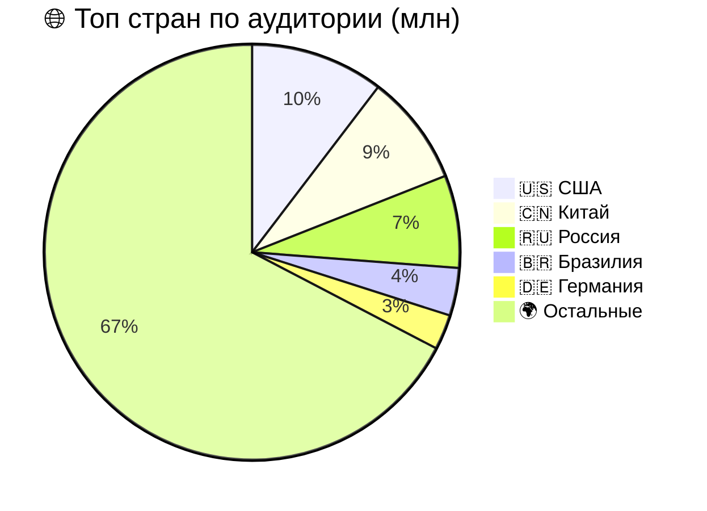
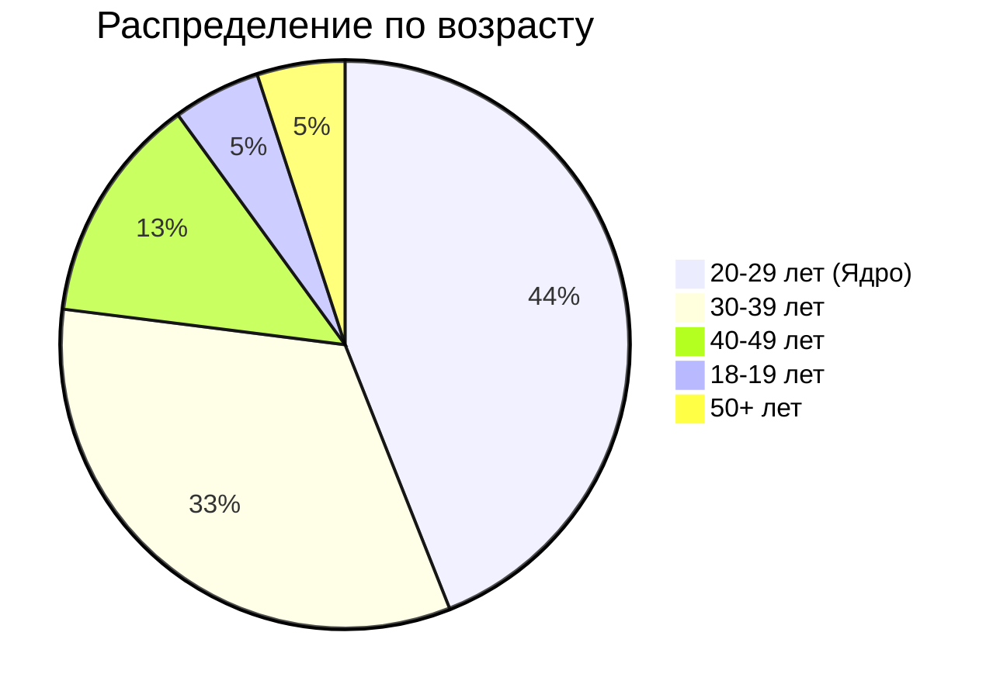
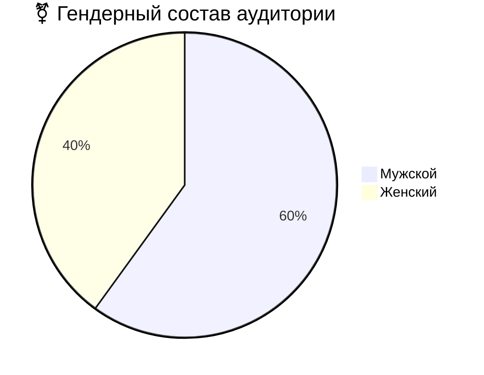

# Аналог Steam
## 1. Тема и целевая аудитория
### 1.1 Тема
**Steam** - международная цифровая платформа для дистрибуции и социального взаимодействия, которая позволяет:
- Покупать, скачивать и автоматически обновлять игры из каталога более 100 000+ тайтлов
- Участвовать в многопользовательских сессиях с голосовым чатом, приглашениями и системой друзей
- Обмениваться игровыми предметами, коллекционными карточками и внутриигровыми ценностями через **Торговую площадку**
- Создавать и монетизировать пользовательский контент через Steam Workshop
- Транслировать геймплей в реальном времени и взаимодействовать с сообществом через обзоры, скриншоты и форумы
- Использовать облачные сохранения, семейный доступ и кроссплатформенную синхронизацию
- Получать персонализированные рекомендации на основе игровой истории и поведенческих паттернов
**География и покрытие** - глобальное, с локализацией на 29+ языков и региональным ценообразованием
### 1.2 Функционал __MVP__
MVP включает в себя:
- Регистраци и авторизацию(двухфакторная аутентификация, OAuth, email-проверка)
- Каталог игр с фильтрами(цена, жанр, рейтинг, поиск)
- Оценка/отзыв об игре
- Страница продукта(трейлер, описание, системные требования, обзоры)
- Корзина и платежная система
- Список друзей(статус онлайн/оффлайн, в игре или нет)
- Библиотека пользователя(облачное сохранение, установка, запуск игр)
- Система достижений и игровая статистика
- Уведомления(скидки, активность друзей, вход в аккаунт)
### 1.3 Целевая аудитория
#### Ключевые метрики
|Метрика|Значение(миллионы)|
|:---:|:---:|
|MAU|132|
|DAU|69|
|PCU|41,66|
|DAU/MAU Ratio|52,27%|

#### Региональное распределение


#### Демографические данные пользователей


#### Гендерное распределение пользователей

## 2. Расчет нагрузки
### - GET /api/catalog/search
При запуске Steam точка входа каталог(сделано в целях привлечения пользователей к продуктам и их покупке) => __~55% пользователей__ как минимум один раз реализуют запрос + __~50% от 55%__ продолжает просмотр продуктов и просматривает минимум 5 страниц. Также во время распродаж, скидок, акций достигается пик количества запросов(коэффициент пика = 40)
__RPS_среднее = (0,55 * DAU + 0,55 * 0,5 * DAU * 5) / (24 * 60 * 60) = 1537__ 
__RPS_пиковое = RPS_среднее * 40 = 61493__

### - GET /api/product/{id}
Как выше сказано, пользователей, которые заходят для просмотра продукта, __0,55 * 0,5 * DAU = ~18975000__. Просматривают примерно 5 страниц различных игр для сравнения и последующей покупки или выбора => __18975000 * 5 = 94875000__ запросов за день
В день релиза долгождпнного продукта может произойти БУМ, в следствие чего лягут сервера, данного сценария нам надо избежать
__RPS_среднее = 94875000/(24 * 60 * 60) = 1098__
__RPS_пиковое = RPS_среднее * 29 = 31844__

### - POST /api/review
Для расчета ручки написания отзыва подсчитано среднее количество отзывов игр ~8240(В статистике стим есть количество отзывов за последний месяц) дальше умножили на 1000(топ игр) и добавили количество отзывов, которые улучшают статистику(у CS2 93106 отзывов) = __8 335 018 запросов в день__
Достигает пиковых значений после завершения прохождения игр, то есть по вечерам и выходным, также большое количество отзывов после релиза продукта
__RPS_среднее = 8 335 018 / (30 * 24 * 60 * 60) = 3__
__RPS_пиковое = RPS_среднее * 40 = 120__

### - GET /api/library
Каждый пользователь заходит в библиотеку. Внесем коэффициент 1.8 , который отвечает за перерыв между сессиями, смена аккаунта и тому подбное. Пиковый коэффициент вводится ввиду того, что сессий будет больше вечером из-за рабочего дня или выходные = 20.
__RPS_среднее = (69 000 000 * 1.8) / (24 * 60 * 60) = 1438__
__RPS_пиковое = RPS_среднее * 20 = 28750__

### - POST /api/library/install
Скачка игры, довольно редкая функция, так как в среднем пользователь сачивает 4 игры в месяц.
Пиковый коэффициент зависит от праздников, релизов, выходных ~200
__RPS_среднее = (4 / 30) * DAU / (24 * 60 * 60) = 106__
__RPS_пиковое = RPS_среднее * 200 = 21 296__

### - POST /api/cloudsave/sync
Мало игр использует облачное сохранение, однако игры, у которых пиковое значение используют этот функционал: CS2, Dota2, PUBG and other. Следую ранее сказанному примерно 10кк пользователей играют в игры использующее облачное сохранение(из стим дб).
Пиковый коэффициент в отпускные сроки, выходные и вечера = 6
__RPS_среднее = 10 000 000 / (24 * 60 * 60) = 115__
__RPS_пиковое = RPS_среднее * 6 = 694__

### - GET /api/notifications
Пользователей, которые проверяют уведомления примерно 80% ввиду того, что приходят как скидки, сообщения от других пользователей и уведомление о входе в аккаунт. В среднем 5 уведомлений.
Пиковый коэффициент: 5(вечерние сессии)
__RPS_среднее = (69 000 000 * 5 * 0.8) / (24 * 60 * 60) = 3194__
__RPS_пиковое = RPS_среднее * 5 = 15 973__

### - POST /api/payment/process
Оплата производится крайне редко, так как емть много бесплатных игр. Примерно 0.17% от DAU, однако пиковое значение может быть очень большим. Пиковый коэффициент: 1000
__RPS_среднее = (69 000 000 * 0,0017) / (24 * 60 * 60) = ~2__
__RPS_пиковое = RPS_пиковое * 1000 = 2000__

### - POST /api/auth/login
1.3 пользователя может несколько раз авторизовываться в день. Пиковое значение постраспрадажное = 2
__RPS_среднее = (69 000 000 * 1.3) / (24 * 60 * 60) = 1039__
__RPS_пиковое = RPS_среднее * 2 = 2076__

## 2.3 Технические метрики: RPS по методам

| Метод / Эндпоинт | Формула расчёта (средний) | Средний RPS | Пиковый RPS | Коэф. пика | Обоснование пика |
|-----------------|---------------------------|-------------|-------------|------------|-----------------|
| `GET /api/catalog/search` | `(0.55 × DAU + 0.55 × 0.5 × DAU × 5) / 86 400` | **1 537** | **45 000–60 000** | ×30–40 | Распродажи, релизы, утренний трафик |
| `GET /api/product/{id}` | `(0.55 × 0.5 × DAU × 5) / 86 400` | **1 098** | **30 000–35 000** | ×29–32 | Релиз ожидаемого тайтла, сравнение игр |
| `POST /api/review` | `8 335 018 / 30 * 86 400` | **3** | **120** | ×40 | Вечерние сессии, завершение игр, пост-релиз |
| `GET /api/library` | `(DAU × 1.8) / 86 400` | **1 438** | **25 000–30 000** | ×20 | Вечерний пик после рабочего дня, выходные |
| `POST /api/library/install` | `(4/30 × DAU) / 86 400` | **106** | **20 000–25 000** | ×200 | Распродажи, бесплатные раздачи, крупные релизы |
| `POST /api/cloudsave/sync` | `10 000 000 / 86 400` | **115** | **600–800** | ×6 | Вечерние сессии, выходные, отпускные периоды |
| `GET /api/notifications` | `(0.8 × DAU × 5) / 86 400` | **3 194** | **15 000–18 000** | ×5 | Утренние/вечерние проверки, пуш-триггеры |
| `POST /api/payment/process` | `(0.0017 × DAU) / 86 400` | **~1.4** | **400–600** | ×300 | Крупные распродажи (консервативная оценка) |
| `POST /api/auth/login` | `(DAU × 1.3) / 86 400` | **1 039** | **3 000–5 000** | ×3–5 | Утренний вход, пост-распродажный трафик, 2FA |
| **ИТОГО** | — | **~8 600** | **~142 000–183 000** | — | Суммарная нагрузка на API-шлюз |


## 4 Логическая БД
```
erDiagram
    USERS {
        _ id PK
        _ email "AK"
        _ password_hash
        _ created_at
        _ updated_at
        _ last_login
        _ region
        _ preferences_json
    }
    USER_PROFILES {
        _ id PK
        _ user_id FK "AK"
        _ avatar_url
        _ display_name "AK"
        _ bio
        _ privacy_settings_json
        _ created_at
        _ updated_at
    }
    SESSIONS {
        _ id PK
        _ session_token "AK"
        _ user_id FK
        _ device_info
        _ ip_address
        _ created_at
        _ expires_at
    }
    USER_WALLET {
        _ id PK
        _ user_id FK "AK"
        _ balance_cents
        _ currency
        _ created_at
        _ updated_at
    }
    WALLET_TRANSACTIONS {
        _ id PK
        _ user_wallet_id FK
        _ amount_cents
        _ transaction_type
        _ payment_method
        _ status
        _ created_at
    }
    GAMES {
        _ id PK
        _ title "AK"
        _ developer
        _ publisher
        _ release_date
        _ price_cents
        _ genres_json
        _ tags_json
        _ system_requirements_json
        _ created_at
        _ updated_at
    }
    GAME_MEDIA {
        _ id PK
        _ game_id FK
        _ media_type
        _ media_url
        _ resolution
        _ file_size_bytes
        _ created_at
    }
    USER_LIBRARY {
        _ id PK
        _ user_id FK
        _ game_id FK
        _ owned_bool
        _ installed_bool
        _ cloud_save_enabled
        _ playtime_minutes
        _ last_played
        _ created_at
        _ updated_at
    }
    REVIEWS {
        _ id PK
        _ user_id FK
        _ game_id FK
        _ rating
        _ title
        _ body
        _ helpful_count
        _ created_at
        _ updated_at
    }
    FRIENDS {
        _ id PK
        _ user_id FK
        _ friend_id FK
        _ status
        _ since_date
        _ created_at
    }
    NOTIFICATIONS {
        _ id PK
        _ user_id FK
        _ notification_text
        _ type
        _ status
        _ read_bool
        _ created_at
        _ updated_at
    }
    CLOUD_SAVES {
        _ id PK
        _ user_id FK
        _ game_id FK
        _ file_path
        _ file_size_bytes
        _ checksum
        _ version
        _ created_at
        _ updated_at
    }
    ACHIEVEMENTS {
        _ id PK
        _ game_id FK
        _ achievement_name
        _ description
        _ icon_url
        _ points
        _ created_at
    }
    USER_ACHIEVEMENTS {
        _ id PK
        _ user_id FK
        _ achievement_id FK
        _ unlocked_bool
        _ unlocked_at
        _ progress_percent
        _ created_at
        _ updated_at
    }
    INVENTORY_ITEMS {
        _ id PK
        _ user_id FK
        _ item_type
        _ item_name
        _ item_rarity
        _ tradeable_bool
        _ acquired_at
        _ created_at
        _ updated_at
    }
    INVENTORY_TRANSACTIONS {
        _ id PK
        _ from_user_id FK
        _ to_user_id FK
        _ inventory_item_id FK
        _ transaction_type
        _ status
        _ created_at
    }
    ACTIVITY_LOGS {
        _ id PK
        _ user_id FK
        _ event_type
        _ event_data_json
        _ ip_address
        _ created_at
    }
    CACHE_USER_DATA {
        _ id PK
        _ user_id FK "AK"
        _ cached_data_json
        _ expires_at
        _ created_at
        _ updated_at
    }
    CACHE_GAME_CATALOG {
        _ id PK
        _ game_id FK "AK"
        _ cached_data_json
        _ expires_at
        _ created_at
        _ updated_at
    }

    USERS ||--|| USER_PROFILES : has
    USERS ||--o{ SESSIONS : has
    USERS ||--|| USER_WALLET : has
    USERS ||--o{ USER_LIBRARY : owns
    USERS ||--o{ REVIEWS : writes
    USERS ||--o{ FRIENDS : befriends
    USERS ||--o{ NOTIFICATIONS : receives
    USERS ||--o{ CLOUD_SAVES : has
    USERS ||--o{ USER_ACHIEVEMENTS : unlocks
    USERS ||--o{ INVENTORY_ITEMS : owns
    USERS ||--o{ ACTIVITY_LOGS : generates
    USERS ||--o{ CACHE_USER_DATA : cached
    
    USER_WALLET ||--o{ WALLET_TRANSACTIONS : has
    
    GAMES ||--o{ GAME_MEDIA : contains
    GAMES ||--o{ USER_LIBRARY : in
    GAMES ||--o{ REVIEWS : receives
    GAMES ||--o{ ACHIEVEMENTS : has
    GAMES ||--o{ CACHE_GAME_CATALOG : cached
    
    USER_LIBRARY }|--|| GAMES : contains
    
    FRIENDS }|--|| USERS : references
    FRIENDS }|--|| USERS : references
    
    ACHIEVEMENTS ||--o{ USER_ACHIEVEMENTS : unlocked_by
    
    INVENTORY_ITEMS ||--o{ INVENTORY_TRANSACTIONS : transferred_in
    INVENTORY_ITEMS ||--o{ INVENTORY_TRANSACTIONS : transferred_out
```
## Источники данных
- https://steamdb.info/app/753/charts
- https://steamdb.info/app/753/charts/#max(для выяснения регистрации и авторизации)
- https://icon-era.com/statistics/steam-game-statistics/
- https://worldpopulationreview.com/country-rankings/steam-users-by-country
- https://store.steampowered.com/stats/stats(офф сайт: пользователей залогинино)
- 
