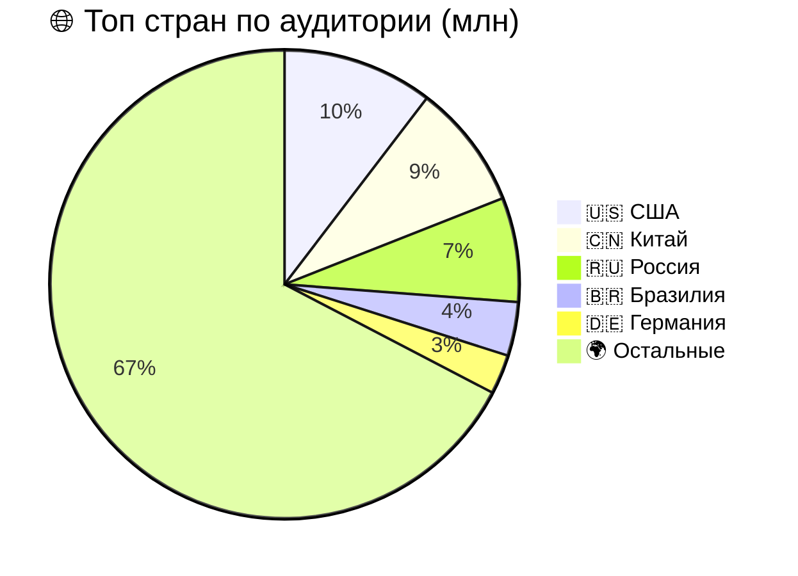
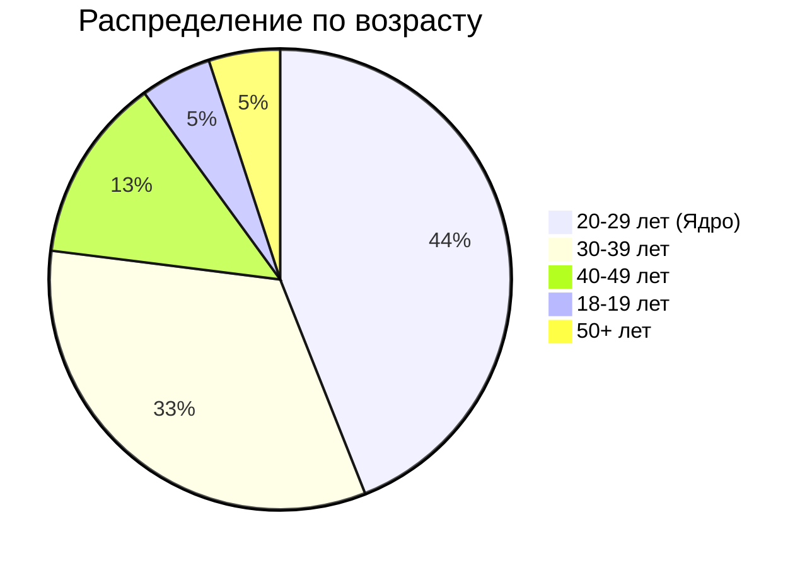
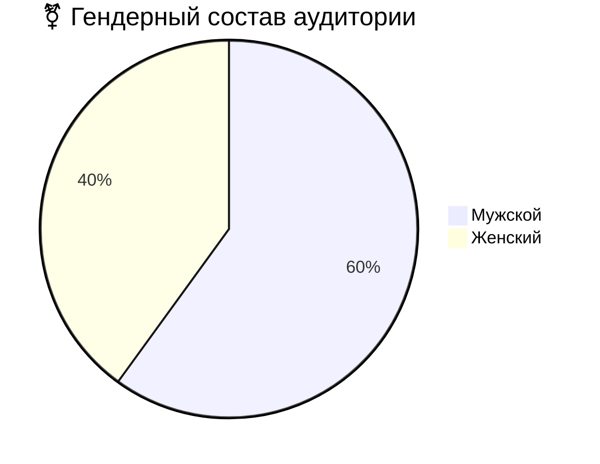
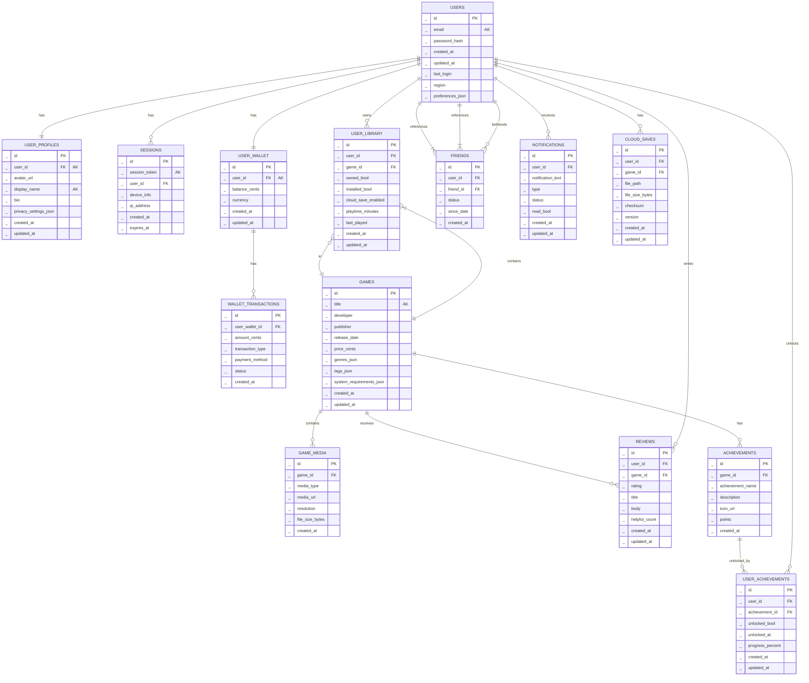

# Аналог Steam
## 1. Тема и целевая аудитория
### 1.1 Тема
**Steam** - международная цифровая платформа для дистрибуции и социального взаимодействия, которая позволяет:
- Покупать, скачивать и автоматически обновлять игры из каталога более 100 000+ тайтлов
- Участвовать в многопользовательских сессиях с голосовым чатом, приглашениями и системой друзей
- Обмениваться игровыми предметами, коллекционными карточками и внутриигровыми ценностями через **Торговую площадку**
- Создавать и монетизировать пользовательский контент через Steam Workshop
- Транслировать геймплей в реальном времени и взаимодействовать с сообществом через обзоры, скриншоты и форумы
- Использовать облачные сохранения, семейный доступ и кроссплатформенную синхронизацию
- Получать персонализированные рекомендации на основе игровой истории и поведенческих паттернов
**География и покрытие** - глобальное, с локализацией на 29+ языков и региональным ценообразованием
### 1.2 Функционал __MVP__
MVP включает в себя:
- Регистраци и авторизацию(двухфакторная аутентификация, OAuth, email-проверка)
- Каталог игр с фильтрами(цена, жанр, рейтинг, поиск)
- Оценка/отзыв об игре
- Страница продукта(трейлер, описание, системные требования, обзоры)
- Корзина и платежная система
- Список друзей(статус онлайн/оффлайн, в игре или нет)
- Библиотека пользователя(облачное сохранение, установка, запуск игр)
- Система достижений и игровая статистика
- Уведомления(скидки, активность друзей, вход в аккаунт)
### 1.3 Целевая аудитория
#### Ключевые метрики
|Метрика|Значение(миллионы)|
|:---:|:---:|
|MAU|132|
|DAU|69|
|PCU|41,66|
|DAU/MAU Ratio|52,27%|

#### Региональное распределение

#### Демографические данные пользователей

#### Гендерное распределение пользователей

## 2. Расчет нагрузки

### 2.1 Исходные данные для расчета

Дальше все расчеты опираются на следующие публичные цифры:

* выручка Steam за 2024 год: $10.8 млрд;
* доля именно game sales в выручке: 61%;
* средняя цена топовых продаваемых игр на Steam в 2025 году: $21.41;
* средний ecommerce conversion rate: 2.58%;
* доля сессий, доходящих до product page: около 50%;
* среднее число страниц за сессию для ecommerce: 2.6;
* средний cart abandonment rate: 70.22%;
* типичный диапазон review-to-sales ratio для Steam-игр: примерно 1 отзыв на 30-60 продаж;
* средний weekly playtime на платформе: 7.1 часа;
* медианный пользователь Steam за год играет в 4 игры, а медианная серия активных дней составляет 6 дней. ([IconEra][2])

Для отзывов принимаю 1 отзыв на 40 покупок как рабочее проектное значение внутри диапазона 30-60. Для библиотеки, логина и cloud save добавляю консервативные проектные коэффициенты, потому что публичной нормальной статистики по этим операциям Valve не публикует.

### 2.2 Продуктовые метрики

Покупки в день

[
Purchases/day = \frac{10.8\text{ млрд} \times 0.61}{21.41 \times 365} \approx 843,032
]

Сессии магазина в день

[
Store\ sessions/day = \frac{843,032}{0.0258} \approx 32.68\text{ млн}
]

Просмотры карточек игры в день

[
Product\ views/day = 32.68\text{ млн} \times 0.5 \approx 16.34\text{ млн}
]

Запросы поиска/листинга каталога в день

[
Catalog\ page\ views/day = 32.68\text{ млн} \times (2.6 - 0.5) \approx 68.62\text{ млн}
]

Отзывы в день

[
Reviews/day = \frac{843,032}{40} \approx 21,076
]

Для остальных действий приняты проектные допущения:
* библиотека открывается в среднем 1.2 раза на DAU в день;
* логин/новая авторизационная сессия происходит 0.9 раза на DAU в день;
* cloud save используют 20% DAU, и у такой сессии в среднем есть 2 sync-операции: при запуске и при завершении игры.

| Метрика                | Формула                           |    Значение |
| ---------------------- | --------------------------------- | ----------: |
| MAU                    | исходное значение                 | 147 000 000 |
| DAU                    | исходное значение                 |  69 000 000 |
| Покупки в день         | (10.8e9 × 0.61) / (21.41 × 365) |     843 032 |
| Store sessions/day     | purchases / 0.0258              |  32 675 659 |
| Product views/day      | store_sessions × 0.5            |  16 337 829 |
| Catalog page views/day | store_sessions × 2.1            |  68 618 884 |
| Reviews/day            | purchases / 40                  |      21 076 |
| Library opens/day      | DAU × 1.2                       |  82 800 000 |
| Login/day              | DAU × 0.9                       |  62 100 000 |
| Cloud save sync/day    | DAU × 0.2 × 2                   |  27 600 000 |

### 2.3 RPS по основным методам

Пиковые коэффициенты приняты так:

* каталог: ×8, потому что распродажи и баннерный трафик резко разгоняют browse-нагрузку;
* карточка игры: ×10, потому что релизы и скидки концентрируют трафик на ограниченном числе hot keys;
* библиотека и логин: ×4, вечерний пик и выходные;
* checkout: ×8, распродажи;
* review: ×6;
* cloud save: ×4.

| Метод                   | Действий в день | Средний RPS | Пиковый RPS |
| ----------------------- | --------------: | ----------: | ----------: |
| GET /catalog/search   |      68 618 884 |         794 |       6 354 |
| GET /game/{id}        |      16 337 829 |         189 |       1 891 |
| GET /library          |      82 800 000 |         958 |       3 833 |
| POST /auth/login      |      62 100 000 |         719 |       2 875 |
| POST /checkout/create |       2 830 866 |          33 |         262 |
| POST /payment/confirm |         843 032 |          10 |          78 |
| POST /review          |          21 076 |        0.24 |         1.5 |
| POST /cloudsave/sync  |      27 600 000 |         319 |       1 278 |

Суммарная пиковая API-нагрузка для MVP получается порядка 15 тыс. RPS без учета выдачи бинарных билдов. Основной highload тут живет не в JSON API, а в доставке игровых файлов. Исходные входные метрики для расчета взяты из публичной статистики Steam и ecommerce-бенчмарков. ([IconEra][2])

### 2.4 Сетевой трафик

По Steam Year in Review 2025 пользователи сервиса такого класса скачали 100 exabytes данных за 2025 год, то есть в среднем 274 PB/day. Это соответствует средней нагрузке порядка 25.4 Tbps только на installs/updates. Сумма региональных пиков со страницы Steam Download Stats дает ориентир по глобальному пику около 58.6 Tbps. ([Steam Community][3])

Для API и cloud save принимаю следующие проектные средние размеры полезной нагрузки:

* search/list response: 60 KB;
* game page: 120 KB;
* library: 50 KB;
* login response: 5 KB;
* checkout/payment: 8 KB;
* review write: 4 KB;
* cloud save blob: 5 MB.

| Тип трафика                | Средний трафик | Пиковый трафик |
| -------------------------- | -------------: | -------------: |
| Установка и обновление игр |      25.4 Tbps |      58.6 Tbps |
| Cloud save sync            |      13.4 Gbps |      53.6 Gbps |
| JSON API суммарно          |       1.0 Gbps |       6.7 Gbps |

Вывод неприятный, но полезный: download/update CDN полностью доминирует по сети, а API и БД доминируют по числу операций, консистентности и hot-key нагрузке.

---

### - GET /api/catalog/search
При запуске Steam точка входа каталог(сделано в целях привлечения пользователей к продуктам и их покупке) => __~55% пользователей__ как минимум один раз реализуют запрос + __~50% от 55%__ продолжает просмотр продуктов и просматривает минимум 5 страниц. Также во время распродаж, скидок, акций достигается пик количества запросов(коэффициент пика = 40)
__RPS_среднее = (0,55 * DAU + 0,55 * 0,5 * DAU * 5) / (24 * 60 * 60) = 1537__ 
__RPS_пиковое = RPS_среднее * 40 = 61493__

### - GET /api/product/{id}
Как выше сказано, пользователей, которые заходят для просмотра продукта, __0,55 * 0,5 * DAU = ~18975000__. Просматривают примерно 5 страниц различных игр для сравнения и последующей покупки или выбора => __18975000 * 5 = 94875000__ запросов за день
В день релиза долгождпнного продукта может произойти БУМ, в следствие чего лягут сервера, данного сценария нам надо избежать
__RPS_среднее = 94875000/(24 * 60 * 60) = 1098__
__RPS_пиковое = RPS_среднее * 29 = 31844__

### - POST /api/review
Для расчета ручки написания отзыва подсчитано среднее количество отзывов игр ~8240(В статистике стим есть количество отзывов за последний месяц) дальше умножили на 1000(топ игр) и добавили количество отзывов, которые улучшают статистику(у CS2 93106 отзывов) = __8 335 018 запросов в день__
Достигает пиковых значений после завершения прохождения игр, то есть по вечерам и выходным, также большое количество отзывов после релиза продукта
__RPS_среднее = 8 335 018 / (30 * 24 * 60 * 60) = 3__
__RPS_пиковое = RPS_среднее * 40 = 120__

### - GET /api/library
Каждый пользователь заходит в библиотеку. Внесем коэффициент 1.8 , который отвечает за перерыв между сессиями, смена аккаунта и тому подбное. Пиковый коэффициент вводится ввиду того, что сессий будет больше вечером из-за рабочего дня или выходные = 20.
__RPS_среднее = (69 000 000 * 1.8) / (24 * 60 * 60) = 1438__
__RPS_пиковое = RPS_среднее * 20 = 28750__

### - POST /api/library/install
Скачка игры, довольно редкая функция, так как в среднем пользователь сачивает 4 игры в месяц.
Пиковый коэффициент зависит от праздников, релизов, выходных ~200
__RPS_среднее = (4 / 30) * DAU / (24 * 60 * 60) = 106__
__RPS_пиковое = RPS_среднее * 200 = 21 296__

### - POST /api/cloudsave/sync
Мало игр использует облачное сохранение, однако игры, у которых пиковое значение используют этот функционал: CS2, Dota2, PUBG and other. Следую ранее сказанному примерно 10кк пользователей играют в игры использующее облачное сохранение(из стим дб).
Пиковый коэффициент в отпускные сроки, выходные и вечера = 6
__RPS_среднее = 10 000 000 / (24 * 60 * 60) = 115__
__RPS_пиковое = RPS_среднее * 6 = 694__

### - GET /api/notifications
Пользователей, которые проверяют уведомления примерно 80% ввиду того, что приходят как скидки, сообщения от других пользователей и уведомление о входе в аккаунт. В среднем 5 уведомлений.
Пиковый коэффициент: 5(вечерние сессии)
__RPS_среднее = (69 000 000 * 5 * 0.8) / (24 * 60 * 60) = 3194__
__RPS_пиковое = RPS_среднее * 5 = 15 973__

### - POST /api/payment/process
Оплата производится крайне редко, так как емть много бесплатных игр. Примерно 0.17% от DAU, однако пиковое значение может быть очень большим. Пиковый коэффициент: 1000
__RPS_среднее = (69 000 000 * 0,0017) / (24 * 60 * 60) = ~2__
__RPS_пиковое = RPS_пиковое * 1000 = 2000__

### - POST /api/auth/login
1.3 пользователя может несколько раз авторизовываться в день. Пиковое значение постраспрадажное = 2
__RPS_среднее = (69 000 000 * 1.3) / (24 * 60 * 60) = 1039__
__RPS_пиковое = RPS_среднее * 2 = 2076__

## 2.3 Технические метрики: RPS по методам

| Метод / Эндпоинт | Формула расчёта (средний) | Средний RPS | Пиковый RPS | Коэф. пика | Обоснование пика |
|-----------------|---------------------------|-------------|-------------|------------|-----------------|
| `GET /api/catalog/search` | `(0.55 × DAU + 0.55 × 0.5 × DAU × 5) / 86 400` | **1 537** | **45 000–60 000** | ×30–40 | Распродажи, релизы, утренний трафик |
| `GET /api/product/{id}` | `(0.55 × 0.5 × DAU × 5) / 86 400` | **1 098** | **30 000–35 000** | ×29–32 | Релиз ожидаемого тайтла, сравнение игр |
| `POST /api/review` | `8 335 018 / 30 * 86 400` | **3** | **120** | ×40 | Вечерние сессии, завершение игр, пост-релиз |
| `GET /api/library` | `(DAU × 1.8) / 86 400` | **1 438** | **25 000–30 000** | ×20 | Вечерний пик после рабочего дня, выходные |
| `POST /api/library/install` | `(4/30 × DAU) / 86 400` | **106** | **20 000–25 000** | ×200 | Распродажи, бесплатные раздачи, крупные релизы |
| `POST /api/cloudsave/sync` | `10 000 000 / 86 400` | **115** | **600–800** | ×6 | Вечерние сессии, выходные, отпускные периоды |
| `GET /api/notifications` | `(0.8 × DAU × 5) / 86 400` | **3 194** | **15 000–18 000** | ×5 | Утренние/вечерние проверки, пуш-триггеры |
| `POST /api/payment/process` | `(0.0017 × DAU) / 86 400` | **~1.4** | **400–600** | ×300 | Крупные распродажи (консервативная оценка) |
| `POST /api/auth/login` | `(DAU × 1.3) / 86 400` | **1 039** | **3 000–5 000** | ×3–5 | Утренний вход, пост-распродажный трафик, 2FA |
| **ИТОГО** | — | **~8 600** | **~142 000–183 000** | — | Суммарная нагрузка на API-шлюз |

## 5 Логическая БД

|Таблица|Описание|
|:--:|:--:|
|users|Таблица для хранения основных данных пользователей: email, хеш пароля, дата регистрации, последний вход, регион, настройки предпочтений (JSON)|
|user_profiles|Таблица профилей пользователей: аватар, отображаемое имя, биография, настройки приватности (JSON). Связь один-к-одному с USERS|
|sessions|Таблица для хранения активных сессий пользователя: токен сессии, информация об устройстве, IP-адрес, время создания и истечения срока действия|
|user_wallet|Таблица кошелька пользователя: баланс в центах, валюта, дата создания и обновления. Связь один-к-одному с USERS|
|wallet_transactions|Таблица транзакций кошелька: сумма, тип транзакции, метод оплаты, статус, дата создания. Связь многие-к-одному с USER_WALLET|
|games|Таблица каталога игр: название, разработчик, издатель, дата релиза, цена, жанры (JSON), теги (JSON), системные требования (JSON)|
|game_media|Таблица медиа-контента игр: тип медиа (скриншот/трейлер/обложка), URL, разрешение, размер файла. Связь многие-к-одному с GAMES|
|user_library|	
Таблица библиотеки пользователя: принадлежность игры, статус установки, облачные сохранения, время в игре, последний запуск. Связь многие-ко-многим USERS-GAMES|
|reviews|Таблица отзывов и оценок: пользователь, игра, рейтинг, заголовок, текст отзыва, количество лайков, дата создания и обновления|
|friends|Таблица дружеских связей: user_id (инициатор), friend_id (друг), статус связи (запрос/принят/заблокирован), дата установления связи. Само-референсная связь на USERS|
|notifications|Таблица уведомлений: текст уведомления, тип, статус, флаг прочтения, дата создания и обновления. Связь многие-к-одному с USERS|
|cloud_saves|	
Таблица облачных сохранений: путь к файлу, размер, контрольная сумма, версия, дата создания и обновления. Связь многие-ко-многим USERS-GAMES|
|achievement|Таблица достижений игр: название достижения, описание, иконка, баллы. Связь многие-к-одному с GAMES|
|user_achievement|Таблица прогресса достижений пользователя: флаг разблокировки, дата разблокировки, процент прогресса. Связь многие-ко-многим USERS-ACHIEVEMENTS|

### Размеры данных и нагрузки на чтение/запись
|Таблица|Расчет|
|:--:|:--:|
|users|16(id) + 255×2(email) + 60×2(password_hash) + 8(created_at) + 8(updated_at) + 8(last_login) + 10×2(region) + 500(preferences_json) = 1 190 байт × 132 млн / 1024³ = **~146 ГБ**|
|user_profiles|16(id) + 16(user_id) + 255×2(avatar_url) + 50×2(display_name) + 500×2(bio) + 300(privacy_settings_json) + 8(created_at) + 8(updated_at) = 1 958 байт × 132 млн / 1024³ = **~240 ГБ**|
|sessions|16(id) + 256×2(session_token) + 16(user_id) + 200×2(device_info) + 45×2(ip_address) + 8(created_at) + 8(expires_at) = 1 050 байт × 138 млн / 1024³ = **~134 ГБ**|
|user_wallet|16(id) + 16(user_id) + 8(balance_cents) + 3×2(currency) + 8(created_at) + 8(updated_at) = 62 байта × 132 млн / 1024³ = **~7.6 ГБ**|
|wallet_transactions|16(id) + 16(user_wallet_id) + 8(amount_cents) + 20×2(transaction_type) + 30×2(payment_method) + 15×2(status) + 8(created_at) = 178 байт × 3.5 млн/мес / 1024³ = **~0.58 ГБ/мес**|
|games|16(id) + 200×2(title) + 100×2(developer) + 100×2(publisher) + 8(release_date) + 8(price_cents) + 200(genres_json) + 300(tags_json) + 500(system_requirements_json) + 8(created_at) + 8(updated_at) = 1 848 байт × 100 000 / 1024³ = **~0.17 ГБ**|
|game_media|16(id) + 16(game_id) + 20×2(media_type) + 500×2(media_url) + 20×2(resolution) + 8(file_size_bytes) + 8(created_at) = 1 128 байт × 500 000 / 1024³ = **~0.52 ГБ**|
|user_library|16(id) + 16(user_id) + 16(game_id) + 1(owned_bool) + 1(installed_bool) + 1(cloud_save_enabled) + 8(playtime_minutes) + 8(last_played) + 8(created_at) + 8(updated_at) = 83 байта × 528 млн / 1024³ = **~41 ГБ**|
|reviews|16(id) + 16(user_id) + 16(game_id) + 4(rating) + 100×2(title) + 2000×2(body) + 8(helpful_count) + 8(created_at) + 8(updated_at) = 4 276 байт × 13.2 млн/мес / 1024³ = **~52 ГБ/мес**|
|friends|16(id) + 16(user_id) + 16(friend_id) + 15×2(status) + 8(since_date) + 8(created_at) = 94 байта × 1.65 млрд / 1024³ = **~144 ГБ**|
|notifications|16(id) + 16(user_id) + 500×2(notification_text) + 30×2(type) + 15×2(status) + 1(read_bool) + 8(created_at) + 8(updated_at) = 1 139 байт × 10.35 млрд/мес / 1024³ = **~11 ТБ/мес**|
|cloud_saves|16(id) + 16(user_id) + 16(game_id) + 500×2(file_path) + 8(file_size_bytes) + 64×2(checksum) + 4(version) + 8(created_at) + 8(updated_at) = 1 204 байта × 276 млн / 1024³ = **~310 ГБ**|
|achievements|16(id) + 16(game_id) + 100×2(achievement_name) + 300×2(description) + 500×2(icon_url) + 4(points) + 8(created_at) = 1 844 байта × 5 млн / 1024³ = **~8.6 ГБ**|
|user_achievements|16(id) + 16(user_id) + 16(achievement_id) + 1(unlocked_bool) + 8(unlocked_at) + 4(progress_percent) + 8(created_at) + 8(updated_at) = 77 байт × 345 млн/мес / 1024³ = **~25 ГБ/мес**|

## 6. Физическая схема БД

### 6.1 Общие принципы физической реализации

При переходе от логической модели к физической используются разные типы хранилищ в зависимости от профиля нагрузки и требований к консистентности:

* PostgreSQL используется для транзакционных и сравнительно компактных данных, где важны строгая консистентность, уникальные ограничения и связи.
* ScyllaDB используется для самых нагруженных пользовательских сущностей с большим количеством чтений и записей, где требуется горизонтальное масштабирование.
* Redis Cluster используется для горячих данных с TTL: активных сессий, счетчиков непрочитанных уведомлений и кешей.
* S3-совместимое object storage используется для бинарных объектов: файлов сохранений и медиа игры.
* OpenSearch используется как денормализованный поисковый индекс по каталогу игр.

На физическом уровне вносятся следующие изменения по сравнению с логической схемой:

1. SESSIONS физически хранятся в Redis, а не в реляционной БД.
2. GAME_MEDIA и CLOUD_SAVES делятся на метаданные и бинарные объекты. Метаданные хранятся в БД, сами файлы лежат в object storage.
3. REVIEWS, FRIENDS, NOTIFICATIONS, USER_LIBRARY, USER_ACHIEVEMENTS денормализуются под основные шаблоны чтения.
4. Для GAMES.title и USER_PROFILES.display_name не вводится физическая уникальность, так как такие ограничения создают ложные конфликты. Уникальность сохраняется по техническим идентификаторам и email.

---

### 6.2 Схема физического размещения данных

flowchart TB
    subgraph PG["PostgreSQL 16 + Patroni"]
        USERS["users"]
        USER_PROFILES["user_profiles"]
        USER_WALLET["user_wallet"]
        WALLET_TRANSACTIONS["wallet_transactions_* (partition by month)"]
        GAMES["games"]
        GAME_MEDIA_META["game_media_meta"]
        ACHIEVEMENTS["achievements"]
    end

    subgraph SCY["ScyllaDB Cluster"]
        USER_LIBRARY["user_library_by_user"]
        REVIEWS_GAME["reviews_by_game"]
        REVIEWS_USER["reviews_by_user"]
        FRIENDS["friends_by_user"]
        NOTIFICATIONS["notifications_by_user"]
        CLOUD_SAVES_META["cloud_saves_meta_by_user_game"]
        USER_ACHIEVEMENTS["user_achievements_by_user"]
    end

    subgraph REDIS["Redis Cluster"]
        SESSIONS["session:{token}"]
        USER_SESSIONS["user_sessions:{user_id}"]
        UNREAD["notifications_unread:{user_id}"]
        HOT_CACHE["hot cache"]
    end

    subgraph S3["S3 / MinIO"]
        GAME_MEDIA_FILES["bucket: game-media"]
        CLOUD_SAVE_FILES["bucket: cloud-saves"]
    end

    subgraph OS["OpenSearch"]
        GAMES_INDEX["games_search_index"]
    end

    USERS --> USER_PROFILES
    USERS --> USER_WALLET
    USER_WALLET --> WALLET_TRANSACTIONS
    GAMES --> GAME_MEDIA_META
    GAMES --> ACHIEVEMENTS

    GAMES --> USER_LIBRARY
    GAMES --> REVIEWS_GAME
    GAMES --> CLOUD_SAVES_META
    ACHIEVEMENTS --> USER_ACHIEVEMENTS

    GAME_MEDIA_META --> GAME_MEDIA_FILES
    CLOUD_SAVES_META --> CLOUD_SAVE_FILES
    GAMES --> GAMES_INDEX

---

### 6.3 Выбор СУБД, индексы, денормализация, шардинг и резервирование
| Логическая таблица    | Физическое представление                                        | СУБД             | Индексы                                                                                             | Шардинг / партиционирование                         | Резервирование               |
| --------------------- | --------------------------------------------------------------- | ---------------- | --------------------------------------------------------------------------------------------------- | --------------------------------------------------- | ---------------------------- |
| users               | users                                                         | PostgreSQL       | PK(id), UNIQUE(email), INDEX(last_login), INDEX(region)                                     | без шардинга, чтение с read replica                 | 1 primary + 2 replicas       |
| user_profiles       | user_profiles                                                 | PostgreSQL       | PK(id), UNIQUE(user_id), INDEX(user_id)                                                       | без шардинга                                        | 1 primary + 2 replicas       |
| sessions            | session:{token}, user_sessions:{user_id}                    | Redis Cluster    | key-based access по токену и user_id                                                                | native Redis sharding по hash slot                  | 3 masters + 3 replicas       |
| user_wallet         | user_wallet                                                   | PostgreSQL       | PK(id), UNIQUE(user_id)                                                                         | без шардинга                                        | 1 primary + 2 replicas       |
| wallet_transactions | wallet_transactions_YYYY_MM                                   | PostgreSQL       | PK(id), INDEX(user_wallet_id, created_at DESC), INDEX(status, created_at)                     | range partition по created_at помесячно           | 1 primary + 2 replicas       |
| games               | games                                                         | PostgreSQL       | PK(id), INDEX(release_date), INDEX(price_cents)                                               | без шардинга                                        | 1 primary + 2 replicas       |
| game_media          | game_media_meta + файлы в bucket: game-media                | PostgreSQL + S3  | PK(id), INDEX(game_id, media_type)                                                              | без шардинга, файлы по префиксу game_id/          | PG replicas + S3 replication |
| user_library        | user_library_by_user                                          | ScyllaDB         | PRIMARY KEY ((user_id), game_id)                                                                  | распределение по partition key user_id            | RF=3                         |
| reviews             | reviews_by_game, reviews_by_user                            | ScyllaDB         | PRIMARY KEY ((game_id), created_at, review_id) и PRIMARY KEY ((user_id), created_at, review_id) | partition key game_id и отдельно user_id        | RF=3                         |
| friends             | friends_by_user                                               | ScyllaDB         | PRIMARY KEY ((user_id), friend_id)                                                                | partition key user_id                             | RF=3                         |
| notifications       | notifications_by_user + unread counter в Redis                | ScyllaDB + Redis | PRIMARY KEY ((user_id), created_at, notification_id)                                              | partition key user_id, TTL по старым уведомлениям | RF=3 + Redis replica         |
| cloud_saves         | cloud_saves_meta_by_user_game + файлы в bucket: cloud-saves | ScyllaDB + S3    | PRIMARY KEY ((user_id, game_id), version)                                                         | partition key (user_id, game_id)                  | RF=3 + S3 replication        |
| achievements        | achievements                                                  | PostgreSQL       | PK(id), INDEX(game_id)                                                                          | без шардинга                                        | 1 primary + 2 replicas       |
| user_achievements   | user_achievements_by_user                                     | ScyllaDB         | PRIMARY KEY ((user_id), game_id, achievement_id)                                                  | partition key user_id                             | RF=3                         |

---

### 6.4 Денормализация физической схемы

Для уменьшения числа тяжелых join-запросов и повышения скорости чтения используются денормализованные представления.

#### 1. Отзывы

Логическая таблица REVIEWS разбивается на две физические таблицы:

* reviews_by_game для чтения отзывов на странице игры;
* reviews_by_user для отображения отзывов конкретного пользователя.

При создании или обновлении отзыва запись пишется сразу в обе таблицы. Это устраняет дорогостоящие выборки по двум разным ключам.

#### 2. Друзья

Таблица FRIENDS хранится как friends_by_user.
Связь дублируется в обе стороны:

* (user_id -> friend_id)
* (friend_id -> user_id)

Это позволяет мгновенно получать список друзей пользователя без обратных join-операций.

#### 3. Уведомления

Уведомления хранятся в notifications_by_user, а количество непрочитанных дополнительно дублируется в Redis-ключ:

* notifications_unread:{user_id}

Это позволяет быстро отдавать счетчик уведомлений без чтения большого раздела ScyllaDB.

#### 4. Облачные сохранения

Физически CLOUD_SAVES разделяется на:

* cloud_saves_meta_by_user_game для метаданных;
* объект в bucket: cloud-saves для бинарного содержимого.

Таким образом БД не нагружается хранением больших файлов, а отвечает только за метаданные, контрольные суммы и версии.

#### 5. Каталог игр

По таблице games строится отдельный денормализованный индекс games_search_index в OpenSearch.
В индекс попадают:

* название игры;
* разработчик;
* издатель;
* теги;
* жанры;
* цена;
* агрегаты по отзывам.

Пользовательский поиск идет в OpenSearch, а PostgreSQL остается источником истины.

---

### 6.5 Детализация физической реализации по таблицам

#### users

Типы полей:

* id — bigint или uuid
* email — varchar(255)
* password_hash — varchar(255)
* created_at, updated_at, last_login — timestamptz
* region — varchar(16)
* preferences_json — jsonb

Особенности:

* таблица хранится в PostgreSQL;
* email индексируется уникально;
* preferences_json не выносится в отдельные таблицы, так как не участвует в частых фильтрах;
* чтение пользовательского профиля возможно с реплик, запись только в primary.

#### user_profiles

Типы полей:

* id, user_id — bigint или uuid
* avatar_url — text
* display_name — varchar(64)
* bio — text
* privacy_settings_json — jsonb

Особенности:

* физическая уникальность по display_name не создается;
* профиль читается в связке с users, но хранится отдельно для уменьшения ширины основной таблицы пользователя.

#### sessions

Физически вместо SQL-таблицы используются структуры Redis:

* session:{token} -> hash:

  * user_id
  * device_info
  * ip_address
  * created_at
  * expires_at
* user_sessions:{user_id} -> set токенов

Особенности:

* TTL устанавливается по expires_at;
* массовое удаление сессий пользователя выполняется по user_sessions:{user_id};
* при перезапуске кластера используется AOF.

#### wallet_transactions

Физически таблица партиционируется по месяцам:

* wallet_transactions_2026_01
* wallet_transactions_2026_02
* и так далее.

Это нужно по двум причинам:

* таблица накапливается во времени;
* типичный запрос почти всегда ограничен временным интервалом.

#### games

Типы полей:

* genres_json, tags_json, system_requirements_json хранятся как jsonb.

Особенности:

* PostgreSQL остается источником истины;
* пользовательский поиск не идет напрямую по JSONB, а выполняется через OpenSearch;
* обновления каталога проталкиваются в индекс асинхронно через event bus.

#### game_media

Метаданные:
* id, game_id, media_type, media_url, resolution, file_size_bytes, created_at

Файлы:

* хранятся в bucket: game-media/{game_id}/{media_id}

Особенности:

* media_url содержит ссылку на object storage или CDN;
* сами изображения и трейлеры не хранятся в PostgreSQL.

#### user_library

Физическая таблица в ScyllaDB:

PRIMARY KEY ((user_id), game_id)

Колонки:

* owned_bool
* installed_bool
* cloud_save_enabled
* playtime_minutes
* last_played
* created_at
* updated_at

Особенности:

* основной запрос это “показать библиотеку пользователя”;
* выбран partition key user_id, потому что библиотека читается целиком по пользователю;
* наличие game_id в clustering key позволяет быстро проверить владение конкретной игрой.

#### reviews

Физические таблицы:

1. reviews_by_game

   * PRIMARY KEY ((game_id), created_at, review_id)

2. reviews_by_user

   * PRIMARY KEY ((user_id), created_at, review_id)

Особенности:

* обе таблицы заполняются синхронно из одного события;
* сортировка по created_at DESC позволяет быстро отдавать последние отзывы;
* отдельные агрегаты helpful_count, rating_avg, reviews_count можно хранить в кешируемой таблице или Redis.

#### friends

Физическая таблица:

PRIMARY KEY ((user_id), friend_id)

Колонки:

* status
* since_date
* created_at

Особенности:

* связи записываются в обе стороны;
* запрос “список друзей пользователя” читается одной операцией по partition key.

#### notifications

Физическая таблица:

PRIMARY KEY ((user_id), created_at, notification_id)

Колонки:

* notification_text
* type
* status
* read_bool
* created_at
* updated_at

Особенности:

* старые уведомления удаляются по TTL, например через 90 дней;
* счетчик непрочитанных хранится отдельно в Redis;
* горячая выборка выполняется по пользователю и временному диапазону.

#### cloud_saves

Физические сущности:

1. cloud_saves_meta_by_user_game

   * PRIMARY KEY ((user_id, game_id), version)

2. объект в bucket: cloud-saves/{user_id}/{game_id}/{version}

Колонки метаданных:

* file_path
* file_size_bytes
* checksum
* version
* created_at
* updated_at

Особенности:

* бинарный blob не хранится в БД;
* checksum используется для проверки целостности;
* новые версии добавляются append-only.

#### achievements

Таблица остается в PostgreSQL, так как данные сравнительно компактны и редко изменяются.

Индекс:

* INDEX(game_id)

#### user_achievements

Физическая таблица в ScyllaDB:

PRIMARY KEY ((user_id), game_id, achievement_id)

Колонки:

* unlocked_bool
* unlocked_at
* progress_percent
* created_at
* updated_at

Особенности:

* выборка идет по пользователю и игре;
* game_id дублируется физически, чтобы не делать лишние join с таблицей achievements.

---

### 6.6 Балансировка запросов и мультиплексирование подключений

| Хранилище     | Балансировка запросов                                  | Мультиплексирование подключений        |
| ------------- | ------------------------------------------------------ | -------------------------------------- |
| PostgreSQL    | HAProxy/Patroni, разделение primary/replica reads      | PgBouncer в режиме transaction pooling |
| ScyllaDB      | token-aware и shard-aware routing на клиенте           | нативный пул соединений драйвера       |
| Redis Cluster | cluster-aware routing по hash slot                     | встроенный connection pool клиента     |
| S3 / MinIO    | через CDN и S3 API endpoint                            | HTTP keep-alive и multipart upload     |
| OpenSearch    | round-robin по data nodes или через coordinating nodes | connection pool HTTP-клиента           |

---

### 6.7 Клиентские библиотеки и интеграции

Если backend реализуется на Go, используются следующие библиотеки:

| Хранилище  | Библиотека / интеграция               |
| ---------- | ------------------------------------- |
| PostgreSQL | pgx + PgBouncer                   |
| ScyllaDB   | gocql или Scylla shard-aware driver |
| Redis      | go-redis                            |
| S3 / MinIO | minio-go или AWS SDK S3             |
| OpenSearch | opensearch-go                       |
Если backend реализуется на Python, аналогичный набор:

| Хранилище  | Библиотека / интеграция |
| ---------- | ----------------------- |
| PostgreSQL | asyncpg / psycopg   |
| ScyllaDB   | cassandra-driver      |
| Redis      | redis-py              |
| S3 / MinIO | boto3 / minio       |
| OpenSearch | opensearch-py         |

---

### 6.8 Схема резервного копирования

| Хранилище  | Схема бэкапа                                                                    |
| ---------- | ------------------------------------------------------------------------------- |
| PostgreSQL | ежедневный full backup + непрерывная архивация WAL, PITR 30 дней                |
| ScyllaDB   | ежедневные snapshots + выгрузка в object storage                                |
| Redis      | AOF everysec + репликация мастеров                                            |
| S3 / MinIO | versioning + cross-region replication                                           |
| OpenSearch | snapshots в S3, индекс при необходимости пересобирается из PostgreSQL и событий |

---

### 6.9 Итоговое распределение таблиц по хранилищам

| Хранилище     | Таблицы / сущности                                                                                                                                                     |
| ------------- | ---------------------------------------------------------------------------------------------------------------------------------------------------------------------- |
| PostgreSQL    | users, user_profiles, user_wallet, wallet_transactions, games, game_media_meta, achievements                                                             |
| ScyllaDB      | user_library_by_user, reviews_by_game, reviews_by_user, friends_by_user, notifications_by_user, cloud_saves_meta_by_user_game, user_achievements_by_user |
| Redis Cluster | session:{token}, user_sessions:{user_id}, notifications_unread:{user_id}, hot cache                                                                              |
| S3 / MinIO    | game-media, cloud-saves                                                                                                                                            |
| OpenSearch    | games_search_index                                                                                                                                                   |

---

## Источники данных
- https://steamdb.info/app/753/charts
- https://steamdb.info/app/753/charts/#max(для выяснения регистрации и авторизации)
- https://icon-era.com/statistics/steam-game-statistics/
- https://worldpopulationreview.com/country-rankings/steam-users-by-country
- https://store.steampowered.com/stats/stats(офф сайт: пользователей залогинино)
- 
