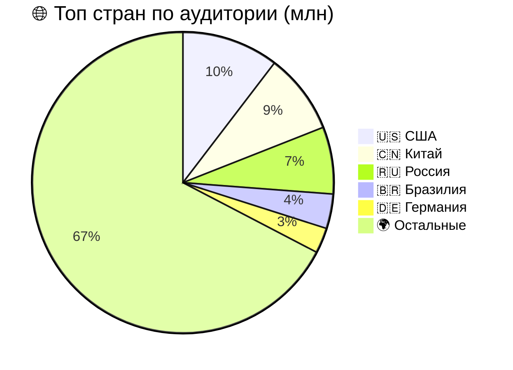
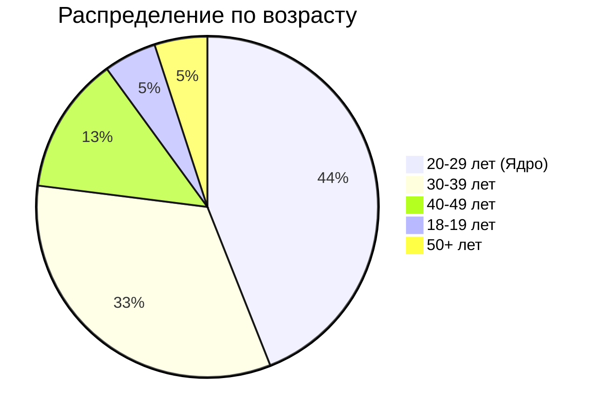
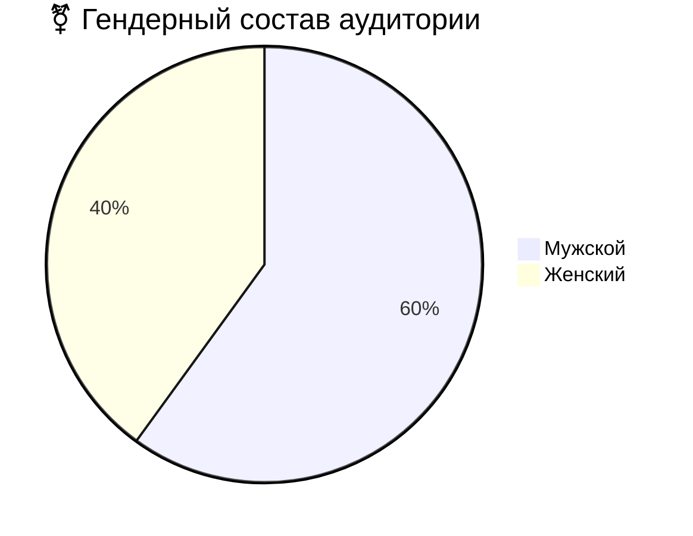
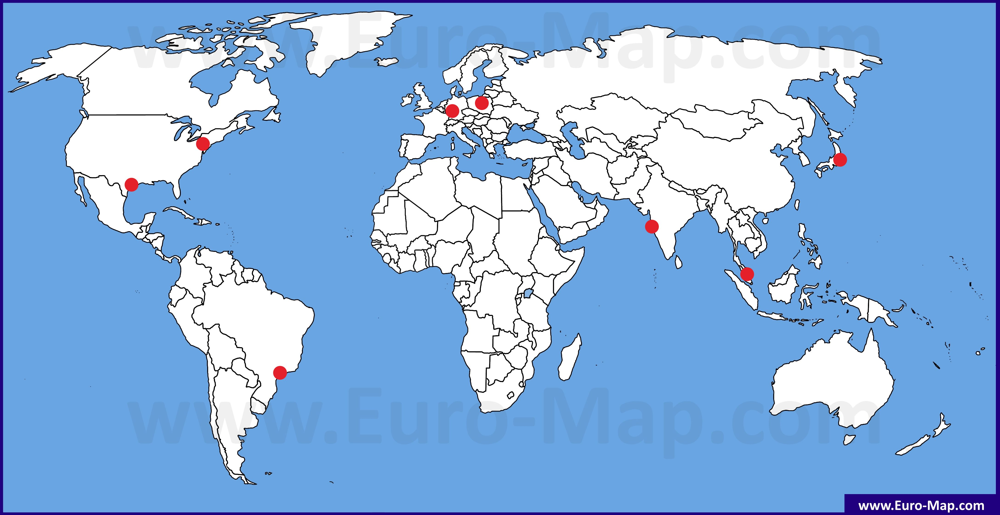
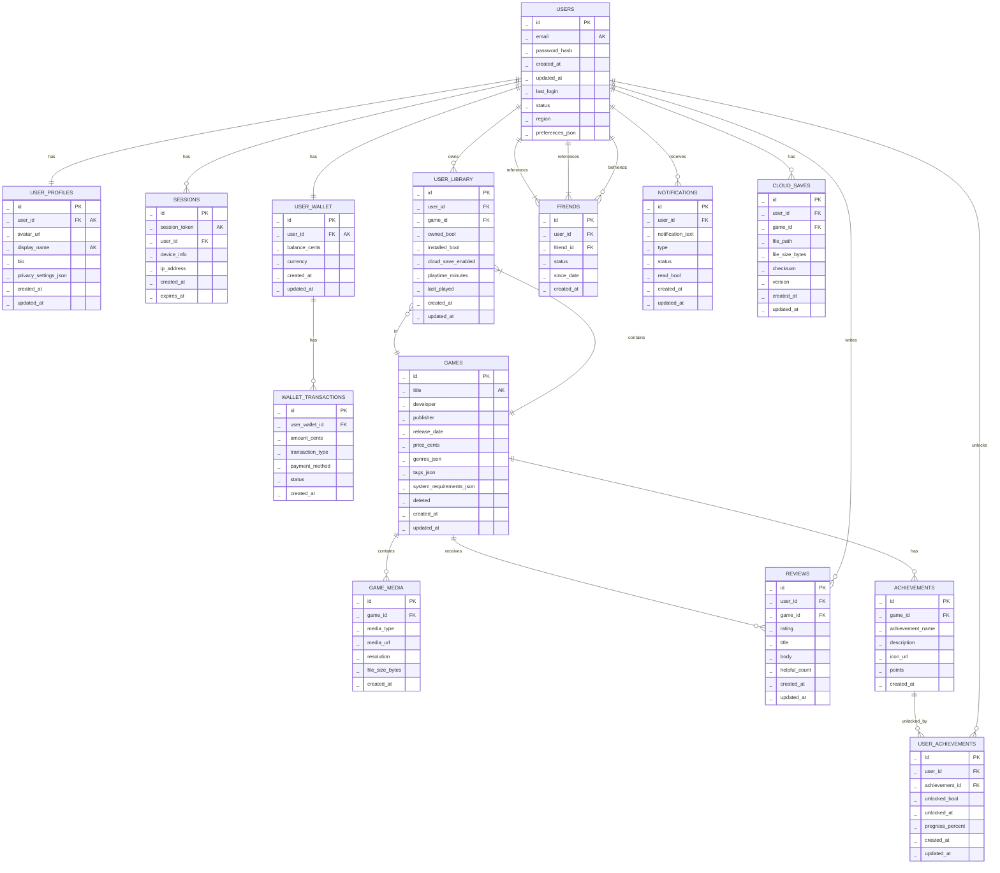
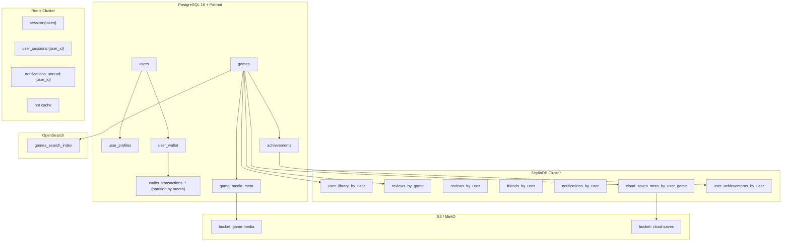

# Аналог Steam
## 1. Тема и целевая аудитория
### 1.1 Тема
**Steam** - международная цифровая платформа для дистрибуции и социального взаимодействия, которая позволяет:
- Покупать, скачивать и автоматически обновлять игры из каталога более 100 000+ тайтлов
- Участвовать в многопользовательских сессиях с голосовым чатом, приглашениями и системой друзей
- Обмениваться игровыми предметами, коллекционными карточками и внутриигровыми ценностями через **Торговую площадку**
- Создавать и монетизировать пользовательский контент через Steam Workshop
- Транслировать геймплей в реальном времени и взаимодействовать с сообществом через обзоры, скриншоты и форумы
- Использовать облачные сохранения, семейный доступ и кроссплатформенную синхронизацию
- Получать персонализированные рекомендации на основе игровой истории и поведенческих паттернов
**География и покрытие** - глобальное, с локализацией на 29+ языков и региональным ценообразованием
### 1.2 Функционал __MVP__
MVP включает в себя:
- Регистраци и авторизацию(двухфакторная аутентификация, OAuth, email-проверка)
- Каталог игр с фильтрами(цена, жанр, рейтинг, поиск)
- Оценка/отзыв об игре
- Страница продукта(трейлер, описание, системные требования, обзоры)
- Корзина и платежная система
- Список друзей(статус онлайн/оффлайн, в игре или нет)
- Библиотека пользователя(облачное сохранение, установка, запуск игр)
- Система достижений и игровая статистика
- Уведомления(скидки, активность друзей, вход в аккаунт)
### 1.3 Целевая аудитория
#### Ключевые метрики
|Метрика|Значение(миллионы)|
|:---:|:---:|
|MAU|132|
|DAU|69|
|PCU|41,66|
|DAU/MAU Ratio|52,27%|

#### Региональное распределение

#### Демографические данные пользователей

#### Гендерное распределение пользователей

## 2. Расчет нагрузки

### 2.1 Исходные данные для расчета

Дальше все расчеты опираются на следующие публичные показатели платформы и смежные ecommerce-бенчмарки:

* Steam указывает, что платформа имеет более 132 млн MAU. В открытых агрегированных оценках для 2025 года также используются 69 млн DAU и отношение DAU/MAU = 52,27%.[1](https://icon-era.com/statistics/steam/) Выручка Steam за 2024 год оценивается в 10,8 млрд долларов, при этом на долю 10 лучших релизов 2023 года пришлось 61% от общего дохода, полученного от новых игр.[2](https://sensortower.com/blog/global-pc-games-market-report-2024) Средняя цена игр в топ-50 Steam по количеству проданных копий к октябрю 2025 года составляет 21,41 доллара. [1](https://partner.steamgames.com/?redir=country.php%3FcountryCode%3DCN%26dateStart%3D2024-08-16%26dateEnd%3D2024-08-22&utm_source=chatgpt.com)
* Для расчета воронки магазина используются следующие ecommerce-метрики. Средний conversion rate в сегменте Toys, Games & Collectables в феврале 2026 года составляет 1,86%. Средний глобальный add-to-cart rate составляет 6,07%. Средний documented cart abandonment rate равен 70,22%. Среднее число страниц за ecommerce-сессию составляет 2,6. Для оценки сезонного пика store-нагрузки используется рост add-to-cart rate с 5,85% в июле 2025 года до 7,46% в ноябре 2024 года, что дает дополнительный коэффициент 1,275. [2](https://www.irpcommerce.com/en/us/ecommercemarketdata.aspx?Market=19)
* Для оценки пользовательского поведения используются внешние агрегированные данные по Steam: 5,2 логина в неделю на пользователя, 1,4 часа на сессию и 1,8 запущенной игры на один DAU. Кроме того, Steam сообщает, что пик активности приходится на окно 19:00-23:00, то есть на 4 часа в сутки.[3](https://sqmagazine.co.uk/steam-statistics/)
* Для cloud save используется доля игр с поддержкой Steam Cloud. По данным SteamDB, в каталоге сейчас 67 225 игр с признаком Steam Cloud. Открытые оценки общего числа игр на платформе дают 128 950 тайтла, значит доля cloud-enabled игр составляет 53,6%. В проектной модели принимается 2 cloud sync-операции на игровую сессию: чтение при запуске и запись при завершении. Сам Steam Cloud официально описан как механизм хранения и синхронизации пользовательских файлов на серверах Steam.[4](https://steamdb.info/instantsearch/)
* Для уведомлений используется официальная статистика Steam Events. Valve указала, что за 2025 год разработчики опубликовали 436 592 Steam Events, которые суммарно дали 3,13 млрд player views. Это подходит как нижняя оценка нагрузки на чтение продуктовых уведомлений и событийной ленты.[5](https://steamcommunity.com/groups/steamworks/announcements/detail/528746884222682053)

Принятые обозначения:
* T_day = 86400 секунд в сутки
* k_day = 24/4 = 6 - коэффициент внутрисуточного пика
* k_sale = 7.46/5.85 = 1.275 - коэффициент сезонного store-пика
* k_store = k_day * k_sale = 7.65 = 8

### 2.2 Продуктовые метрики

#### Количество покупок в день

Purchases = (10.8 * 10^9 * 0.61) / (21.41 * 365) = 843032

#### Количество созданий корзины в день:

Checkout = Purchases/(1 - 0.7022) = 2830866

#### Количество просмотров карточек игр:

Product = Checkout/0.0607 = 46637007

#### Количество store-сессий:

Store = Purchases/ 0.0186 = 45324301

#### Общее число просмотров страниц магазина:

Page = Store * 2.6 = 117843182

#### Из них поисковые и листинговые переходы каталога:

Catalog = Page - Product - Checkout = 68375309

#### Логины в день:

Login = DAU * 5.2 / 7 = 51257143

#### Открытия библиотеки в день:

Library = DAU * 1.8 = 124200000

#### Cloud sync-операции в день:
Прнимаем две операции в виду начала игры(загрузки) и конца игры(выгрузки)

Cloudsave = DAU * 1.8 * 0.521 * 2 = 129398400

#### Чтение ленты уведомлений и событий:
Notifications = 3.13 * 10^9 / 365 = 8575342

#### Отзывы:
Нет данных от самого стим, но возьмем допущение 1 отзыв на 40 покупок по статье.

Reviews = 843032/ 40 = 21076

#### Сводная таблица продуктовых метрик:

|Метрика|Значение|
|:--:|:--:|
|MAU|132000000|
|DAU|69000000|
|Purchases|843032|
|Checkout|2830866|
|Product|46637007|
|Store|45324301|
|Page|117843182|
|Catalog|68375309|
|Login|51257143|
|Library|124200000|
|Cloudsave|129398400|
|Notifications|8575342|
|Reviews|21076|

### 2.3 RPS по основным методам

Пиковые коэффициенты приняты так:

* внутрисуточный пик х6, так как основная часть активности происходит примерно в 4 часа из суток[2](https://icon-era.com/statistics/steam/)
* для ручек покупок есть еще сезонный коэффициент 7.46/ 5.85 = 1.275 * 6 = x8 [3](https://www.envive.ai/post/add-to-cart-rate-statistics?utm_source=chatgpt.com)

| Метод                   | Действий в день | Средний RPS | Пиковый RPS |
| ----------------------- | --------------: | ----------: | ----------: |
| Поиск   |      68 375 309 |         791 |       6 331 |
| Страница игр        |      46 637 007 |         540 |       4 318 |
| Библиотека          |      124 200 000 |         1 438 |       8 625 |
| Авторизация     |      51 257 143 |         593 |       3 560 |
| Корзина |       2 830 866 |          33 |         262 |
| Платежи |         843 032 |          10 |          78 |
| Отзывы         |          21 076 |        0.24 |         2 |
| Облачное сохранение  |      129 398 400 |         1 498 |       8 988 |
| Уведомления | 8 575 342 | 99 | 596|

У аналога Steam основная серверная боль живет не в JSON API магазина. Store/API-контур для MVP укладывается примерно в 5 тыс. avg RPS и 33 тыс. peak RPS. Настоящий highload начинается на контуре доставки билдов, патчей, кэшей, манифестов и объектов Steam Cloud.

### 2.4 Сетевой трафик

Для контура загрузки игр и обновлений используются официальные данные Steam. Valve сообщила, что в 2025 году пользователи Steam скачали 100 exabytes данных. Это соответствует средней нагрузке порядка:

Traffic_cloud = 100 * 10^18 * 8 / 365 / 24 / 3600 = 25.37 Tbps

Таким образом, именно контур delivery/CDN является главным источником сетевой нагрузки в сервисе класса Steam.

Для оценки сетевого трафика storefront-части можно использовать поля в логической бд, которые мы передаем. Расчеты производились исходя из нее.
|Тип запроса|Размер ответа|
|:--:|:--:|
|search|13,9 KiB|
|product|8,1 KiB|
|login|1,05 KiB|
|library|36,1 KiB|
|create|0,5 KiB|
|payment|0,5 KiB|
|review|1,48 KiB|
|notifications|5,4 KiB|
|cloud|0,34 KiB|

Для расчитанных ранее нагрузок:

Traffic_search(avg) = 791 * 14276 * 8/1024^3 = 0,084 Gbps

Traffic_search(peek) = 6331⋅14276⋅8/1024^3 = 0.673 Gbps

...

|Тип трафика|Размер ответа|Средний|Пиковый|
|:--:|:--:|:--:|:--:|
|Каталог и листинг игр|13.9 KiB|	0.084 Gbps|	0.673 Gbps|
|Карточки игр|8.1 KiB|	0.034 Gbps|	0.268 Gbps|
|Авторизация|1.05 |	0.024 Gbps|	0.142 Gbps|
|Библиотека|	0.575 Gbps|	3.45 Gbps|
|Checkout + payment|	0.0027 Gbps|	0.0218 Gbps|
|Reviews|	0.000008 Gbps|	0.000047 Gbps|
|Уведомления|	0.0079 Gbps|	0.0476 Gbps|
|Cloud save|	59.91 Gbps|	359.44 Gbps|
|Storefront/API без cloud save|	0.527 Gbps|	3.395 Gbps|
|Storefront/API с cloud save|	81.81 Gbps|	533.49 Gbps|
|Скачивание игр и обновлений|	25.37 Tbps|	48.8 Tbps|

Из расчётов видно, что даже с учётом cloud save основной объём сетевой нагрузки для сервиса класса Steam создаёт не storefront/API, а именно контур доставки контента. Поэтому при проектировании инфраструктуры необходимо физически и логически разделять application traffic и delivery traffic: использовать отдельные слои балансировки, отдельные пулы серверов и отдельные стратегии кеширования.

### 2.5 Расчет хранилищ

#### OLTP

|Таблица|Оценка числа строк|Размер строки|Объем|
|:--:|:--:|:--:|:--:|
|USERS|	132 000 000|	284 Б|	34.91 GiB|
|USER_PROFILES|	132 000 000|	496 Б|	60.98 GiB|
|SESSIONS|	69 000 000|	192 Б|	12.34 GiB|
|USER_WALLET|	132 000 000|	72 Б	8.85 GiB|
|WALLET_TRANSACTIONS|	1 538 533 400|	96 Б	137.56 GiB|
|GAMES|	129 409|	1 632 Б|	0.20 GiB|
|GAME_MEDIA|	776 454|	208 Б|	0.15 GiB|
|USER_LIBRARY|	1 584 000 000|	83 Б|	122.44 GiB|
|REVIEWS|	38 463 700|	652 Б|	23.36 GiB|
|FRIENDS|	1 320 000 000|	80 Б|	98.35 GiB|
|NOTIFICATIONS|	3 105 000 000|	241 Б|	696.91 GiB|
|CLOUD_SAVES|	660 000 000|	240 Б|	147.52 GiB|
|ACHIEVEMENTS|	6 470 450|	508 Б|	3.06 GiB|
|USER_ACHIEVEMENTS|	13 200 000 000|	77 Б|	946.60 GiB|
Storage_global = 2.239 TiB
Добавляем 20% на индексы, денормализацию и т.д.:
Storage_gl+20 = 2.673TiB

Бинарные объекты:
Допустим на одну игру 5 скриншотов по 1 МВ и 1 трейлер на 50 МВ, а для Cloud_save 1 MB
Storage_cloud_save = 629.43 TiB
Storage_game_media = 6.79 TiB

#### Steam Cloud
По данным SteamDB, поддержку Steam Cloud имеют 67 225 игр из 128 950, то есть около 52.1% каталога. Для расчёта принимается, что облачное хранение активно используется той же долей MAU, а средний активный набор сохранений на одного такого пользователя составляет 10 MB. Это именно проектное допущение, а не публичная цифра Valve. Официальная документация Steam Cloud лишь задаёт ограничения: 100 MB на один write/chunk и предупреждение о снижении производительности при размерах свыше 256 MB.

S_cloud = 132000000 * 67225 * 10MB / 128950 = 0.641 PiB

Если хранить предыдущую версию:
S_cloud = 1.282PiB

## 3. Глобальная балансировка
### Разбиение по доменам
* Основной домен - steam.example.com
Веб-интерфейс платформы, storefront, витрина, входная точка для пользователя.
* API - api.steam.example.com
Авторизация, библиотека, платежные операции, уведомления, достижения, отзывы, работа с профилем.
* Статика - static.steam.example.com
JS/CSS, иконки, мелкие изображения, конфигурационные файлы фронтенда.
* Медиа и загрузки - cdn.steam.example.com
Скриншоты, трейлеры, depot-объекты, игровые билды, патчи и прочие крупные бинарные данные.
* Облачные сохранения - cloud.steam.example.com
Синхронизация Steam Cloud-подобных файлов сохранения и их метаданных.
Такое разбиение оправдано тем, что сама Steam работает как глобально распределенная система с 400+ distributed servers worldwide и 1TB fiber backbone, а официальный Steam Download Stats показывает отдельные крупные контуры нагрузки по регионам Asia, Europe, North America, South America и Russia/CIS.[6](https://www.steamgames.com/steamworks/ov_cloud.php?ref=stebet.net&utm_source=chatgpt.com)
### Расположение дата-центров
Для аналога стим следует разделить инфраструктуру на:
* core-регионы
* edge/download-регионы 
Мы будем размещать edge/download там же, где core, так как будет находиться рядом с крутыми сетевыми хабами.
#### Северная Америка
* Ashburn (US East) - основной регион для storefront/API в Северной Америке. Выбор обусловлен тем, что Ашберн находится в крупнейшем мировом рынке дата-центров и имеет очень высокую плотность волоконной связности. Это хороший базовый регион для control plane и платежного контура.[7](https://services.global.ntt/en-us/services-and-products/global-data-centers/global-locations/americas/ashburn-data-centers?utm_source=chatgpt.com)
* Dallas (US Central) - резервный регион для Северной Америки и точка диверсификации относительно US East. Здесь ставка делается на географическое разнесение и более устойчивое аварийное переключение внутри континента.
#### Европа
* Frankfurt - основной европейский регион. Франкфурт является одним из крупнейших интернет-хабов мира: DE-CIX Frankfurt называет себя ведущим в мире, с пиковым трафиком 18+ Tbps и доступом к 1000+ сетям. Это логичный выбор для европейского storefront/API и части origin-трафика.[8](https://www.de-cix.net/en/locations/frankfurt?utm_source=chatgpt.com)
* Warsaw - резервный европейский регион и точка покрытия Восточной Европы и части трафика Russia/CIS. Equinix называет Варшаву major interconnection gateway to eastern Europe, а локальные IX в Польше дают хороший задел под regional edge и резерв storefront/API.[9](https://www.equinix.com/data-centers/europe-colocation/poland-colocation/warsaw-data-centers?utm_source=chatgpt.com)
#### Азия
* Singapore - основной APAC-регион. SGIX работает как распределенная peering-сеть в крупных дата-центрах в Сингапуре и позиционируется как один из крупнейших открытых и нейтральных интернет-обменников Азии. Для глобального игрового сервиса это удобная точка для Юго-Восточной Азии и части островных государств.[10](https://www.sgix.sg/about-us-2/?utm_source=chatgpt.com)
* Mumbai - второй азиатский регион. DE-CIX India указывает, что в Мумбаи подключено 407 сетей, а сам узел уже проходил отметку 1 Tbps пропускная способность и продолжал наращивать емкость. Это делает Мумбаи хорошей точкой для Южной Азии и части ближневосточного трафика.[11](https://www.de-cix.in/news/de-cix-india-indias-largest-interconnection-platform-crosses-500-connected-networks-making-it/?utm_source=chatgpt.com)
* Tokyo - то первый коммерческий IX Японии, один из крупнейших по числу клиентов и важная часть интернет-инфраструктуры Японии.[12](https://www.jpix.ad.jp/en/?utm_source=chatgpt.com)
#### Южная Америка
* São Paulo - основной южноамериканский регион. IX.br и NIC.br прямо указывают, что São Paulo является глобальным лидером по объему трафика обмена и в 2026 году достигал 32 Tbps на локальном PTT. Для континента это очевидная точка размещения core edge/download-инфраструктуры.[12](https://nic.br/noticia/releases/ix-br-hits-record-50-tbit-s-of-aggregated-internet-traffic-driven-by-content-and-digital-services/?utm_source=chatgpt.com)

|Дата-центр/регион|Доля глобальной нагрузки|
|:--:|:--:|
|Singapore|	22.0%|
|Mumbai|	14.0%|
|Tokyo |	5.6%|
|Frankfurt|	18.0%|
|Warsaw |	11.9%|
|Ashburn|	12.0%|
|Dallas|	8.7%|
|São Paulo|	7.8%|
|Итого|	100%|

### Используемые технологии глобальной балансировки
|Домен|	Метод регулировки|
|:--:|:--:|
|steam.example.com|	Latency-based DNS + health checks|
|api.steam.example.com|	Latency-based DNS + weighted failover|
|static.steam.example.com|	GeoDNS + CDN|
|cdn.steam.example.com|	GeoDNS + anycast edge|
|cloud.steam.example.com|	Latency-based DNS + regional stickiness|

Latency-based DNS используется для storefront/API/community/cloud, потому что для них важны задержка и корректное направление пользователя в ближайший здоровый регион.

GeoDNS + anycast edge используется для cdn, потому что основной трафик здесь состоит из крупных бинарных объектов. Для него важнее не sticky-сессия, а близость к пользователю, большая пропускная способность и быстрый вывод трафика на ближайший POP.

### Перенаправление запросов в случае отказа
* Ashburn → резерв: Dallas → 2-й резерв: Frankfurt
* Dallas → резерв: Ashburn → 2-й резерв: São Paulo
* Frankfurt → резерв: Warsaw → 2-й резерв: Ashburn
* Warsaw → резерв: Frankfurt → 2-й резерв: Singapore
* Singapore → резерв: Tokyo → 2-й резерв: Mumbai
* Tokyo → резерв: Singapore → 2-й резерв: Mumbai
* Mumbai → резерв: Singapore → 2-й резерв: Tokyo
* São Paulo → резерв: Ashburn → 2-й резерв: Dallas

## 4. Локальная балансировка
### 4.1 Общий принцип локальной балансировки

Для storefront/API-контура используется L7-балансировка, так как она позволяет:

* маршрутизировать трафик по Host и Path;
* выделять отдельные backend-пулы под разные классы запросов;
* использовать TLS termination;
* включать кэширование для read-only ручек;
* применять rate limiting, circuit breaking и health checks;
* выполнять graceful draining при обновлении инстансов.

Для download/CDN-контура используется отдельный ingress-слой с упором на:

* высокую пропускную способность;
* cache locality;
* origin shield;
* раздельную обработку small metadata requests и large binary downloads.

### 4.2 Балансировка storefront/API-контура

Для доменов steam.example.com, api.steam.example.com и cloud.steam.example.com в каждом регионе используется кластер NGINX / Envoy на L7-уровне.

Прокси-слой выполняет следующие функции:

* TLS termination — разгружает backend-сервисы от криптографических операций;
* маршрутизацию по доменам и путям;
* балансировку между application-server инстансами;
* кэширование популярных ответов каталога и карточек игр;
* сжатие ответов;
* ограничение частоты запросов;
* health checks и исключение деградировавших инстансов;
* connection reuse / keep-alive между proxy и backend.

NGINX официально поддерживает upstream load balancing, параметры backup, down, а также keepalive для повторного использования idle-соединений к backend-серверам. Это позволяет снижать накладные расходы на установку соединений и уменьшать нагрузку на application-пул. [13](nginx.org)

В качестве основного алгоритма балансировки storefront/API предлагается использовать least request. Envoy в официальной документации указывает, что weighted least request учитывает число активных запросов на инстансе и уменьшает вероятность неравномерной перегрузки отдельных узлов. Для контуров с неоднородной задержкой, таких как product page, library и search, это лучше, чем обычный round robin. [14](envoyproxy.io)

### 4.3 Функциональное деление backend-пулов

Локальная балансировка должна учитывать не только число инстансов, но и профиль нагрузки. Поэтому внутри региона backend делится на отдельные функциональные пулы:

* storefront pool — каталог, product page, рекомендации;
* auth/profile pool — логин, сессии, профиль пользователя;
* library/cloud-metadata pool — библиотека, достижения, cloud metadata;
* payment/checkout pool — корзина, оплата, транзакции, entitlements;
* download/origin pool — манифесты, metadata для patch/download, работа с origin storage.

Такое разделение дает два преимущества:

* нагрузка на карточки игр и поиск не влияет на платежный контур;
* massive download traffic не вытесняет storefront/API-запросы с тех же ingress/backend-ресурсов.
### 4.4 Алгоритмы балансировки по типам запросов

Внутри региона предлагается использовать разные алгоритмы балансировки для разных пулов.

|Контур|	Алгоритм|	Причина выбора|
|:--:|:--:|:--:|
|storefront/search/product|	least request|	запросы имеют разную стоимость и задержку, поэтому нужен учет текущей загрузки backend-инстансов|
|auth/profile|	least request|позволяет равномернее распределять burst-нагрузку логинов|
|library/cloud metadata|	least request|	уменьшает вероятность перегрузки отдельных нод при вечернем пике|
|payment/checkout|	least request + приоритетность пула|	платежный контур должен быть изолирован от всплесков read-трафика|
|download/origin| metadata	consistent hash / cache-aware routing|	важно сохранять cache locality и уменьшать лишние запросы к origin|

### 4.5 Локальная балансировка download/CDN-контура

Для cdn.steam.example.com используется отдельный ingress-контур. Его нельзя обслуживать теми же правилами, что storefront/API, потому что у него другой профиль трафика:

* очень большие объекты;
* длинные сессии передачи данных;
* критичная зависимость от cache-hit ratio;
* необходимость разгрузки origin-хранилища.

Внутри региона download-контур строится по схеме:

* edge ingress → regional cache → origin shield → object storage / build storage

Локальная балансировка в этом контуре должна обеспечивать:

* раздельную обработку small metadata requests и large binary downloads;
* сохранение cache locality;
* минимизацию обращений к origin;
* возможность быстрого исключения деградировавших cache/origin-инстансов;
* поддержку keep-alive и reuse соединений к upstream. [12](nginx.org)

Для ingress download-контура разумно использовать:

* consistent hashing или cache-aware routing между cache-узлами;
* origin shield как промежуточный уровень между edge и S3/object storage;
* отдельные backend-пулы под:
манифесты и metadata,
small assets,
large depot/chunk downloads.

Это необходимо, чтобы запросы к metadata и выдача крупных бинарных объектов не конкурировали за одни и те же ресурсы.

### 4.6 Кэширование

Кэширование в локальной балансировке применяется неравномерно.

Кэшируются:

* страницы каталога;
* карточки игр;
* результаты поиска и листинга;
* медиаметаданные;
* community/event pages;
* агрегаты отзывов;
* часть notification bundles.

Не кэшируются или кэшируются ограниченно:

* логин;
* checkout;
* payment;
* операции выдачи entitlements;
* запись отзывов;
* запись cloud save metadata;
* операции изменения библиотеки.

Это позволяет уменьшить нагрузку на backend и базы данных при распродажах, когда большая часть всплеска приходится на hot read traffic.

### 4.7 SSL termination и reuse соединений

SSL termination выполняется на edge/L7-proxy. Это позволяет:

* снизить CPU-нагрузку на backend;
* централизованно управлять сертификатами;
* повторно использовать TLS-сессии;
* эффективно работать с HTTP/2 и HTTP/3;
* уменьшить количество полных handshake-операций.

Между прокси и backend используются keep-alive соединения. NGINX официально поддерживает keepalive connections к upstream-серверам, а в новых версиях эта функциональность включена по умолчанию. Для Steam-подобной системы с большим числом коротких read-запросов это уменьшает сетевой overhead и сокращает задержку на повторные обращения. [12](nginx.org)

### 4.8 API Gateway

Для изоляции внутренней логики и межсервисной маршрутизации используется API Gateway / Backend for Frontend.

Его задачи:

* единая точка входа для desktop/web clients;
* маршрутизация по backend-сервисам;
* аутентификация и авторизация;
* rate limiting;
* сбор технических метрик;
* приоритизация критичных путей (auth, library, checkout, payment);
* graceful degradation неключевых функций.

Примеры деградации:

* при перегрузке можно временно упростить recommendations;
* отключить часть community widgets;
* отдавать stale-cache для product page;
* но сохранить рабочими auth, library, checkout и payment.
### 4.9 Отказоустойчивость внутри региона

Локальная балансировка строится по схеме N+1 с размещением инстансов в нескольких зонах отказа внутри региона. Используются:

* active-active ingress proxies;
* health checks;
* automatic drain деградировавших инстансов;
* connection draining перед удалением ноды;
* rolling update без прерывания активных запросов;
* retry только для idempotent read-path;
* circuit breakers на внешних зависимостях.

Для storefront/API предпочтительно использовать комбинацию:

* active health checks;
* passive health checks / outlier detection;
* резервную емкость не менее N+1 для critical pools (auth, checkout, payment, library).
### 4.10 Вывод

Для аналога Steam локальная балансировка должна быть построена не как единый прокси-контур “для всего”, а как система из нескольких специализированных слоев:

* storefront/API ingress;
* auth/payment ingress;
* download/origin ingress.

Такой подход позволяет:

* изолировать платежный контур от всплесков поиска и карточек игр;
* не смешивать massive binary delivery с JSON/API;
* эффективнее использовать кэширование и keep-alive;
* упростить деградацию второстепенных функций без потери критичных операций.

## 5. Логическая БД

|Таблица|Описание|
|:--:|:--:|
|users|Таблица для хранения основных данных пользователей: email, хеш пароля, дата регистрации, последний вход, регион, статус(онлайн, оффлайн) настройки предпочтений (JSON)|
|user_profiles|Таблица профилей пользователей: аватар, отображаемое имя, биография, настройки приватности (JSON). Связь один-к-одному с USERS|
|sessions|Таблица для хранения активных сессий пользователя: токен сессии, информация об устройстве, IP-адрес, время создания и истечения срока действия|
|user_wallet|Таблица кошелька пользователя: баланс в центах, валюта, дата создания и обновления. Связь один-к-одному с USERS|
|wallet_transactions|Таблица транзакций кошелька: сумма, тип транзакции, метод оплаты, статус, дата создания. Связь многие-к-одному с USER_WALLET|
|games|Таблица каталога игр: название, разработчик, издатель, дата релиза, цена, жанры (JSON), теги (JSON), системные требования (JSON), статус(удаленное или нет)|
|game_media|Таблица медиа-контента игр: тип медиа (скриншот/трейлер/обложка), URL, разрешение, размер файла. Связь многие-к-одному с GAMES|
|user_library|	
Таблица библиотеки пользователя: принадлежность игры, статус установки, облачные сохранения, время в игре, последний запуск. Связь многие-ко-многим USERS-GAMES|
|reviews|Таблица отзывов и оценок: пользователь, игра, рейтинг, заголовок, текст отзыва, количество лайков, дата создания и обновления|
|friends|Таблица дружеских связей: user_id (инициатор), friend_id (друг), статус связи (запрос/принят/заблокирован), дата установления связи. Само-референсная связь на USERS|
|notifications|Таблица уведомлений: текст уведомления, тип, статус, флаг прочтения, дата создания и обновления. Связь многие-к-одному с USERS|
|cloud_saves|	
Таблица облачных сохранений: путь к файлу, размер, контрольная сумма, версия, дата создания и обновления. Связь многие-ко-многим USERS-GAMES|
|achievement|Таблица достижений игр: название достижения, описание, иконка, баллы. Связь многие-к-одному с GAMES|
|user_achievement|Таблица прогресса достижений пользователя: флаг разблокировки, дата разблокировки, процент прогресса. Связь многие-ко-многим USERS-ACHIEVEMENTS|

### Размеры данных и нагрузки на чтение/запись
#### Постоянные таблицы
|Таблица|Расчет|
|:--:|:--:|
|users|16(id) + 255×2(email) + 60×2(password_hash) + 8(created_at) + 8(updated_at) + 8(last_login) + 10×2(region) + 500(preferences_json) = 1 190 байт × 132 млн / 1024³ = **~146 ГБ**|
|user_profiles|16(id) + 16(user_id) + 255×2(avatar_url) + 50×2(display_name) + 500×2(bio) + 300(privacy_settings_json) + 8(created_at) + 8(updated_at) = 1 958 байт × 132 млн / 1024³ = **~240 ГБ**|
|user_wallet|16(id) + 16(user_id) + 8(balance_cents) + 3×2(currency) + 8(created_at) + 8(updated_at) = 62 байта × 132 млн / 1024³ = **~7.6 ГБ**|
|games|16(id) + 200×2(title) + 100×2(developer) + 100×2(publisher) + 8(release_date) + 8(price_cents) + 200(genres_json) + 300(tags_json) + 500(system_requirements_json) + 8(created_at) + 8(updated_at) = 1 848 байт × 129 409 / 1024³ = **~0.22 ГБ**|
|game_media|16(id) + 16(game_id) + 20×2(media_type) + 500×2(media_url) + 20×2(resolution) + 8(file_size_bytes) + 8(created_at) = 1 128 байт × 776 454 / 1024³ = **~0.82 ГБ**|
|user_library|16(id) + 16(user_id) + 16(game_id) + 1(owned_bool) + 1(installed_bool) + 1(cloud_save_enabled) + 8(playtime_minutes) + 8(last_played) + 8(created_at) + 8(updated_at) = 83 байта × 528 млн / 1024³ = **~41 ГБ**|
|friends|16(id) + 16(user_id) + 16(friend_id) + 15×2(status) + 8(since_date) + 8(created_at) = 94 байта × 1.65 млрд / 1024³ = **~144 ГБ**|
|cloud_saves|16(id) + 16(user_id) + 16(game_id) + 500×2(file_path) + 8(file_size_bytes) + 64×2(checksum) + 4(version) + 8(created_at) + 8(updated_at) = 1 204 байта × 660 млн / 1024³ = **~740 ГБ**|
|achievements|16(id) + 16(game_id) + 100×2(achievement_name) + 300×2(description) + 500×2(icon_url) + 4(points) + 8(created_at) = 1 844 байта × 6 470 450 / 1024³ = **~11.1 ГБ**|
|user_achievements|16(id) + 16(user_id) + 16(achievement_id) + 1(unlocked_bool) + 8(unlocked_at) + 4(progress_percent) + 8(created_at) + 8(updated_at) = 77 байт × 13.2 млрд / 1024³ = **~947 ГБ**|

#### Оперативные таблицы
|Таблица|Расчет|
|:--:|:--:|
|sessions|16(id) + 256×2(session_token) + 16(user_id) + 200×2(device_info) + 45×2(ip_address) + 8(created_at) + 8(expires_at) = 1050 Б × 69 млн / 1024³ = **~67.5 ГБ**|

#### Растущие таблицы
|Таблица|Расчет|
|:--:|:--:|
|wallet_transactions|178 Б × (843 032 покупок/день × 30) = 178 Б × 25 290 960 / 1024³ = **~4.19 ГБ/мес**|
|reviews|4276 Б × (21 076 отзывов/день × 30) = 4276 Б × 632 280 / 1024³ = **~2.52 ГБ/мес**|
|notifications|1139 Б × (8 575 342 уведомлений/день × 30) = 1139 Б × 257 260 260 / 1024³ = **~273 ГБ/мес**|
## 6. Физическая схема БД

### 6.1 Общие принципы физической реализации

При переходе от логической модели к физической используются разные типы хранилищ в зависимости от профиля нагрузки и требований к консистентности:

* PostgreSQL используется для транзакционных и сравнительно компактных данных, где важны строгая консистентность, уникальные ограничения и связи.
* ScyllaDB используется для самых нагруженных пользовательских сущностей с большим количеством чтений и записей, где требуется горизонтальное масштабирование.
* Redis Cluster используется для горячих данных с TTL: активных сессий, счетчиков непрочитанных уведомлений и кешей.
* S3-совместимое object storage используется для бинарных объектов: файлов сохранений и медиа игры.
* OpenSearch используется как денормализованный поисковый индекс по каталогу игр.

На физическом уровне вносятся следующие изменения по сравнению с логической схемой:

1. SESSIONS физически хранятся в Redis, а не в реляционной БД.
2. GAME_MEDIA и CLOUD_SAVES делятся на метаданные и бинарные объекты. Метаданные хранятся в БД, сами файлы лежат в object storage.
3. REVIEWS, FRIENDS, NOTIFICATIONS, USER_LIBRARY, USER_ACHIEVEMENTS денормализуются под основные шаблоны чтения.
4. Для GAMES.title и USER_PROFILES.display_name не вводится физическая уникальность, так как такие ограничения создают ложные конфликты. Уникальность сохраняется по техническим идентификаторам и email.

---

### 6.2 Схема физического размещения данных

---

### 6.3 Выбор СУБД, индексы, денормализация, шардинг и резервирование
| Логическая таблица    | Физическое представление                                        | СУБД             | Индексы                                                                                             | Шардинг / партиционирование                         | Резервирование               |
| --------------------- | --------------------------------------------------------------- | ---------------- | --------------------------------------------------------------------------------------------------- | --------------------------------------------------- | ---------------------------- |
| users               | users                                                         | PostgreSQL       | PK(id), UNIQUE(email), INDEX(last_login), INDEX(region)                                     | без шардинга, чтение с read replica                 | 1 primary + 2 replicas       |
| user_profiles       | user_profiles                                                 | PostgreSQL       | PK(id), UNIQUE(user_id), INDEX(user_id)                                                       | без шардинга                                        | 1 primary + 2 replicas       |
| sessions            | session:{token}, user_sessions:{user_id}                    | Redis Cluster    | key-based access по токену и user_id                                                                | native Redis sharding по hash slot                  | 3 masters + 3 replicas       |
| user_wallet         | user_wallet                                                   | PostgreSQL       | PK(id), UNIQUE(user_id)                                                                         | без шардинга                                        | 1 primary + 2 replicas       |
| wallet_transactions | wallet_transactions_YYYY_MM                                   | PostgreSQL       | PK(id), INDEX(user_wallet_id, created_at DESC), INDEX(status, created_at)                     | range partition по created_at помесячно           | 1 primary + 2 replicas       |
| games               | games                                                         | PostgreSQL       | PK(id), INDEX(release_date), INDEX(price_cents)                                               | без шардинга                                        | 1 primary + 2 replicas       |
| game_media          | game_media_meta + файлы в bucket: game-media                | PostgreSQL + S3  | PK(id), INDEX(game_id, media_type)                                                              | без шардинга, файлы по префиксу game_id/          | PG replicas + S3 replication |
| user_library        | user_library_by_user                                          | ScyllaDB         | PRIMARY KEY ((user_id), game_id)                                                                  | распределение по partition key user_id            | RF=3                         |
| reviews             | reviews_by_game, reviews_by_user                            | ScyllaDB         | PRIMARY KEY ((game_id), created_at, review_id) и PRIMARY KEY ((user_id), created_at, review_id) | partition key game_id и отдельно user_id        | RF=3                         |
| friends             | friends_by_user                                               | ScyllaDB         | PRIMARY KEY ((user_id), friend_id)                                                                | partition key user_id                             | RF=3                         |
| notifications       | notifications_by_user + unread counter в Redis                | ScyllaDB + Redis | PRIMARY KEY ((user_id), created_at, notification_id)                                              | partition key user_id, TTL по старым уведомлениям | RF=3 + Redis replica         |
| cloud_saves         | cloud_saves_meta_by_user_game + файлы в bucket: cloud-saves | ScyllaDB + S3    | PRIMARY KEY ((user_id, game_id), version)                                                         | partition key (user_id, game_id)                  | RF=3 + S3 replication        |
| achievements        | achievements                                                  | PostgreSQL       | PK(id), INDEX(game_id)                                                                          | без шардинга                                        | 1 primary + 2 replicas       |
| user_achievements   | user_achievements_by_user                                     | ScyllaDB         | PRIMARY KEY ((user_id), game_id, achievement_id)                                                  | partition key user_id                             | RF=3                         |

---

### 6.4 Денормализация физической схемы

Для уменьшения числа тяжелых join-запросов и повышения скорости чтения используются денормализованные представления.

#### 1. Отзывы

Логическая таблица REVIEWS разбивается на две физические таблицы:

* reviews_by_game для чтения отзывов на странице игры;
* reviews_by_user для отображения отзывов конкретного пользователя.

При создании или обновлении отзыва запись пишется сразу в обе таблицы. Это устраняет дорогостоящие выборки по двум разным ключам.

#### 2. Друзья

Таблица FRIENDS хранится как friends_by_user.
Связь дублируется в обе стороны:

* (user_id -> friend_id)
* (friend_id -> user_id)

Это позволяет мгновенно получать список друзей пользователя без обратных join-операций.

#### 3. Уведомления

Уведомления хранятся в notifications_by_user, а количество непрочитанных дополнительно дублируется в Redis-ключ:

* notifications_unread:{user_id}

Это позволяет быстро отдавать счетчик уведомлений без чтения большого раздела ScyllaDB.

#### 4. Облачные сохранения

Физически CLOUD_SAVES разделяется на:

* cloud_saves_meta_by_user_game для метаданных;
* объект в bucket: cloud-saves для бинарного содержимого.

Таким образом БД не нагружается хранением больших файлов, а отвечает только за метаданные, контрольные суммы и версии.

#### 5. Каталог игр

По таблице games строится отдельный денормализованный индекс games_search_index в OpenSearch.
В индекс попадают:

* название игры;
* разработчик;
* издатель;
* теги;
* жанры;
* цена;
* агрегаты по отзывам.

Пользовательский поиск идет в OpenSearch, а PostgreSQL остается источником истины.

---

### 6.5 Детализация физической реализации по таблицам

#### users

Типы полей:

* id — bigint или uuid
* email — varchar(255)
* password_hash — varchar(255)
* created_at, updated_at, last_login — timestamptz
* region — varchar(16)
* preferences_json — jsonb

Особенности:

* таблица хранится в PostgreSQL;
* email индексируется уникально;
* preferences_json не выносится в отдельные таблицы, так как не участвует в частых фильтрах;
* чтение пользовательского профиля возможно с реплик, запись только в primary.

#### user_profiles

Типы полей:

* id, user_id — bigint или uuid
* avatar_url — text
* display_name — varchar(64)
* bio — text
* privacy_settings_json — jsonb

Особенности:

* физическая уникальность по display_name не создается;
* профиль читается в связке с users, но хранится отдельно для уменьшения ширины основной таблицы пользователя.

#### sessions

Физически вместо SQL-таблицы используются структуры Redis:

* session:{token} -> hash:

  * user_id
  * device_info
  * ip_address
  * created_at
  * expires_at
* user_sessions:{user_id} -> set токенов

Особенности:

* TTL устанавливается по expires_at;
* массовое удаление сессий пользователя выполняется по user_sessions:{user_id};
* при перезапуске кластера используется AOF.

#### wallet_transactions

Физически таблица партиционируется по месяцам:

* wallet_transactions_2026_01
* wallet_transactions_2026_02
* и так далее.

Это нужно по двум причинам:

* таблица накапливается во времени;
* типичный запрос почти всегда ограничен временным интервалом.

#### games

Типы полей:

* genres_json, tags_json, system_requirements_json хранятся как jsonb.

Особенности:

* PostgreSQL остается источником истины;
* пользовательский поиск не идет напрямую по JSONB, а выполняется через OpenSearch;
* обновления каталога проталкиваются в индекс асинхронно через event bus.

#### game_media

Метаданные:
* id, game_id, media_type, media_url, resolution, file_size_bytes, created_at

Файлы:

* хранятся в bucket: game-media/{game_id}/{media_id}

Особенности:

* media_url содержит ссылку на object storage или CDN;
* сами изображения и трейлеры не хранятся в PostgreSQL.

#### user_library

Физическая таблица в ScyllaDB:

PRIMARY KEY ((user_id), game_id)

Колонки:

* owned_bool
* installed_bool
* cloud_save_enabled
* playtime_minutes
* last_played
* created_at
* updated_at

Особенности:

* основной запрос это “показать библиотеку пользователя”;
* выбран partition key user_id, потому что библиотека читается целиком по пользователю;
* наличие game_id в clustering key позволяет быстро проверить владение конкретной игрой.

#### reviews

Физические таблицы:

1. reviews_by_game

   * PRIMARY KEY ((game_id), created_at, review_id)

2. reviews_by_user

   * PRIMARY KEY ((user_id), created_at, review_id)

Особенности:

* обе таблицы заполняются синхронно из одного события;
* сортировка по created_at DESC позволяет быстро отдавать последние отзывы;
* отдельные агрегаты helpful_count, rating_avg, reviews_count можно хранить в кешируемой таблице или Redis.

#### friends

Физическая таблица:

PRIMARY KEY ((user_id), friend_id)

Колонки:

* status
* since_date
* created_at

Особенности:

* связи записываются в обе стороны;
* запрос “список друзей пользователя” читается одной операцией по partition key.

#### notifications

Физическая таблица:

PRIMARY KEY ((user_id), created_at, notification_id)

Колонки:

* notification_text
* type
* status
* read_bool
* created_at
* updated_at

Особенности:

* старые уведомления удаляются по TTL, например через 90 дней;
* счетчик непрочитанных хранится отдельно в Redis;
* горячая выборка выполняется по пользователю и временному диапазону.

#### cloud_saves

Физические сущности:

1. cloud_saves_meta_by_user_game

   * PRIMARY KEY ((user_id, game_id), version)

2. объект в bucket: cloud-saves/{user_id}/{game_id}/{version}

Колонки метаданных:

* file_path
* file_size_bytes
* checksum
* version
* created_at
* updated_at

Особенности:

* бинарный blob не хранится в БД;
* checksum используется для проверки целостности;
* новые версии добавляются append-only.

#### achievements

Таблица остается в PostgreSQL, так как данные сравнительно компактны и редко изменяются.

Индекс:

* INDEX(game_id)

#### user_achievements

Физическая таблица в ScyllaDB:

PRIMARY KEY ((user_id), game_id, achievement_id)

Колонки:

* unlocked_bool
* unlocked_at
* progress_percent
* created_at
* updated_at

Особенности:

* выборка идет по пользователю и игре;
* game_id дублируется физически, чтобы не делать лишние join с таблицей achievements.

---

### 6.6 Балансировка запросов и мультиплексирование подключений

| Хранилище     | Балансировка запросов                                  | Мультиплексирование подключений        |
| ------------- | ------------------------------------------------------ | -------------------------------------- |
| PostgreSQL    | HAProxy/Patroni, разделение primary/replica reads      | PgBouncer в режиме transaction pooling |
| ScyllaDB      | token-aware и shard-aware routing на клиенте           | нативный пул соединений драйвера       |
| Redis Cluster | cluster-aware routing по hash slot                     | встроенный connection pool клиента     |
| S3 / MinIO    | через CDN и S3 API endpoint                            | HTTP keep-alive и multipart upload     |
| OpenSearch    | round-robin по data nodes или через coordinating nodes | connection pool HTTP-клиента           |

---

### 6.7 Клиентские библиотеки и интеграции

Если backend реализуется на Go, используются следующие библиотеки:

| Хранилище  | Библиотека / интеграция               |
| ---------- | ------------------------------------- |
| PostgreSQL | pgx + PgBouncer                   |
| ScyllaDB   | gocql или Scylla shard-aware driver |
| Redis      | go-redis                            |
| S3 / MinIO | minio-go или AWS SDK S3             |
| OpenSearch | opensearch-go                       |
Если backend реализуется на Python, аналогичный набор:

| Хранилище  | Библиотека / интеграция |
| ---------- | ----------------------- |
| PostgreSQL | asyncpg / psycopg   |
| ScyllaDB   | cassandra-driver      |
| Redis      | redis-py              |
| S3 / MinIO | boto3 / minio       |
| OpenSearch | opensearch-py         |

---

### 6.8 Схема резервного копирования

| Хранилище  | Схема бэкапа                                                                    |
| ---------- | ------------------------------------------------------------------------------- |
| PostgreSQL | ежедневный full backup + непрерывная архивация WAL, PITR 30 дней                |
| ScyllaDB   | ежедневные snapshots + выгрузка в object storage                                |
| Redis      | AOF everysec + репликация мастеров                                            |
| S3 / MinIO | versioning + cross-region replication                                           |
| OpenSearch | snapshots в S3, индекс при необходимости пересобирается из PostgreSQL и событий |

---

### 6.9 Итоговое распределение таблиц по хранилищам

| Хранилище     | Таблицы / сущности                                                                                                                                                     |
| ------------- | ---------------------------------------------------------------------------------------------------------------------------------------------------------------------- |
| PostgreSQL    | users, user_profiles, user_wallet, wallet_transactions, games, game_media_meta, achievements                                                             |
| ScyllaDB      | user_library_by_user, reviews_by_game, reviews_by_user, friends_by_user, notifications_by_user, cloud_saves_meta_by_user_game, user_achievements_by_user |
| Redis Cluster | session:{token}, user_sessions:{user_id}, notifications_unread:{user_id}, hot cache                                                                              |
| S3 / MinIO    | game-media, cloud-saves                                                                                                                                            |
| OpenSearch    | games_search_index                                                                                                                                                   |

---

## 8. Технологии
| Технология |	Область применения |	Причина выбора |
|:--:|:--:|:--:|
|Go|	Backend|	высокая производительность, простая эксплуатация, зрелая экосистема|
|PostgreSQL|OLTP|	транзакции, платежи, entitlements|
|RedisCluster|	cache/session|	Подходит для хранения короткоживущих данных: сессий, токенов, счетчиков непрочитанных уведомлений, rate-limit ключей, кэша популярных карточек игр и других hot data. Кластерный режим позволяет горизонтально масштабировать систему и не перегружать основную БД частыми мелкими запросами|
|ScyllaDB / Cassandra|	wide-column OLTP|Хорошо подходит для библиотеки пользователя, уведомлений, достижений, статистики, отзывов и других больших сущностей, читаемых по user_id или game_id. Позволяет горизонтально масштабироваться на много узлов и выдерживать высокий поток операций|
|OpenSearch|	catalog search|	полнотекстовый поиск и фильтры|
|S3-compatible storage|	Объектное хранилище|	Используется для хранения крупных бинарных объектов: медиафайлов игр, патчей, depot-объектов, трейлеров, скриншотов и облачных сохранений|
|Kafka / Redpanda|	асинхронное взаимодействие|	Позволяет развязать сервисы между собой и обрабатывать операции асинхронно: покупки, обновление библиотеки, отправку уведомлений, обновление поискового индекса, обновление рекомендаций и аналитических витрин|
|ClickHouse|	Аналитика|	Используется для хранения и обработки больших объемов событийной аналитик|
|NGINX / Envoy|	edge/L7|	Используются на входе в систему для TLS termination, маршрутизации запросов, балансировки нагрузки, кэширования и базовой защиты от перегрузки|
|Prometheus + Grafana|	Мониторинг и обработка|	метрики и алерты|
|Jaeger / Tempo|	tracing|	Используются для распределенной трассировки в микросервисной архитектуре. Позволяют понять, как запрос проходит через API Gateway, backend-сервисы, очереди и базы данных, а также находить узкие места и деградации по задержке|
|Kubernetes|	оркестрация|	Используется для развертывания, масштабирования и обновления сервисов|

## 9. Обеспечение надежности

### Общие меры по уровням
| Уровень  | Меры |
|:--:|:--:|
| **Уровень ДЦ**                  | Резервирование электропитания, каналов связи, охлаждения и сетевого оборудования. Размещение сервисов в нескольких зонах отказа. Использование UPS и дизель-генераторов.                    |
| **Глобальная балансировка**     | Latency-based DNS и GeoDNS для направления трафика в ближайший здоровый регион. Наличие резервного и второго резервного региона для каждого core-DC.                                        |
| **Локальная балансировка**      | Разделение балансировки storefront/API, payment/auth и download/CDN-контуров. L7-балансировка для API и отдельный ingress/cache-контур для бинарной раздачи.                                |
| **Уровень сервисов**            | Разделение backend-пулов по профилю нагрузки: storefront, auth, payment, library, community, cloud, download. Резервирование CPU, RAM и сети. Graceful degradation для некритичных функций. |
| **Уровень БД и хранилищ**       | Репликация, резервное копирование, кворумные операции для критичных данных, разделение OLTP, wide-column, search и object storage контуров.                                                 |
| **Разработка и инфраструктура** | Code review, unit/integration/e2e testing, CI/CD, статический анализ, rollback, disaster recovery drills, отключение региона в рамках учений.                                               |
| **Наблюдаемость**               | Централизованное логирование, трассировка, мониторинг, профилирование, алерты, контроль SLI/SLO по storefront, auth, checkout, cloud save и CDN.                                            |

### Уровень БД и хранилищ
| Хранилище | Меры|
|:--:|:--:|
| **PostgreSQL**           | 1 primary + 2 replicas. Ежедневный full backup, WAL archiving, PITR. Запись только в primary, чтение с реплик.                                                            |
| **ScyllaDB / Cassandra** | Replication factor = 3. Для критичных пользовательских данных используется `LOCAL_QUORUM`. Денормализация и распределение по partition key для уменьшения hot partitions. |
| **Redis Cluster**        | 3 master + replicas. Хранение sessions, unread counters, hot cache и rate limit state. TTL для короткоживущих данных, persistence для нужных контуров.                    |
| **S3 / MinIO**           | Versioning, replication, lifecycle policies, checksum validation. Раздельные bucket/prefix policies для `game-media` и `cloud-saves`.                                     |
| **OpenSearch**           | Репликация шардов, snapshots в object storage, hot/warm topology, rebuild индекса из PostgreSQL и event stream при необходимости.                                         |
| **Kafka / Redpanda**     | Replication factor = 3. Idempotent producer для критичных топиков. Отдельные retry/DLQ-потоки для побочных задач.  |

### Доролнительные паттерны надежности
| Паттерн | Мера |
|:--:|:--:|
| **Асинхронные паттерны** | Event-driven взаимодействие через Kafka / Redpanda для библиотеки, уведомлений, аналитики, индексации каталога и обновления агрегатов. |
| **Rate Limiting**        | Ограничение частоты запросов на уровне API Gateway и edge ingress. Отдельные лимиты для поиска, auth, checkout, reviews и cloud save.  |
| **Retry**                | Retry только для idempotent read-операций и безопасных внутренних вызовов. Используется exponential backoff и retry budget.            |
| **Circuit Breaker**      | Защита от каскадных отказов между сервисами. При деградации зависимостей сервис отдает fallback или stale-cache.                       |
| **Bulkhead**             | Разделение пулов ресурсов между storefront, payment, cloud save и download-контурами.                                                  |
| **Graceful Shutdown**    | Обработка SIGTERM, завершение in-flight запросов, connection draining, остановка приема новых запросов перед SIGKILL.                  |
| **Graceful Degradation** | При перегрузке отключаются рекомендации, часть community-блоков, расширенные поисковые фильтры и тяжелые вторичные виджеты.            |
| **Idempotency**          | Для checkout/payment и выдачи прав владения используются идемпотентные ключи.   |

### Контрольные метрики надежности

| Контур | Ключевые метрики |
|:--:|:--:|
| **Storefront / Search / Product** | latency, error rate, cache hit ratio                    |
| **Auth**                          | login success rate, token refresh latency               |
| **Checkout / Payment**            | success rate, payment latency, idempotency conflicts    |
| **Library / Cloud Save**          | freshness, sync latency, conflict/error rate            |
| **CDN / Download**                | throughput, cache hit ratio, origin load, retry rate    |
| **Data Layer**                    | replication lag, quorum failures, queue lag, saturation |

### Вывод
Для аналога Steam надежность обеспечивается не только резервированием железа, но и разделением системы на независимые контуры: storefront/API, payment, cloud save и download/CDN. Это позволяет переживать распродажи, релизы и крупные обновления без каскадной деградации всей платформы.

## Источники данных
- https://steamdb.info/app/753/charts
- https://steamdb.info/app/753/charts/#max(для выяснения регистрации и авторизации)
- https://icon-era.com/statistics/steam-game-statistics/
- https://worldpopulationreview.com/country-rankings/steam-users-by-country
- https://store.steampowered.com/stats/stats(офф сайт: пользователей залогинино)
- 
