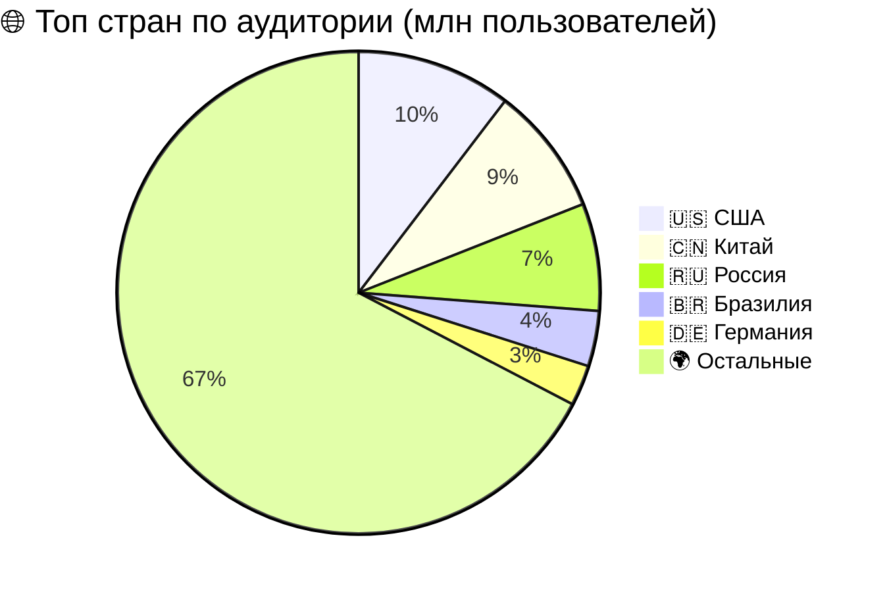
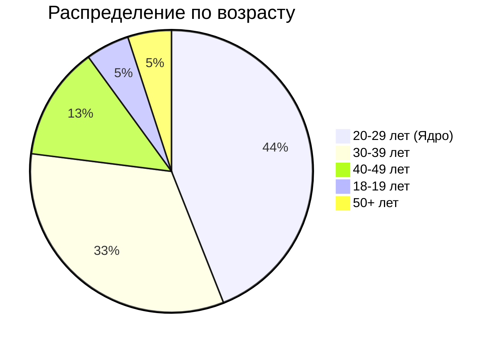
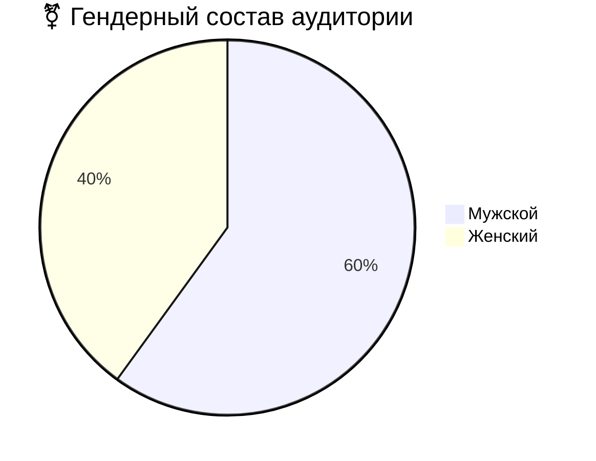

# Аналог Steam
## 1. Тема и целевая аудитория
### 1.1 Тема
**Steam** - международная цифровая платформа для дистрибуции и социального взаимодействия, которая позволяет:
- Покупать, скачивать и автоматически обновлять игры из каталога более 100 000+ тайтлов
- Участвовать в многопользовательских сессиях с голосовым чатом, приглашениями и системой друзей
- Обмениваться игровыми предметами, коллекционными карточками и внутриигровыми ценностями через **Торговую площадку**
- Создавать и монетизировать пользовательский контент через Steam Workshop
- Транслировать геймплей в реальном времени и взаимодействовать с сообществом через обзоры, скриншоты и форумы
- Использовать облачные сохранения, семейный доступ и кроссплатформенную синхронизацию
- Получать персонализированные рекомендации на основе игровой истории и поведенческих паттернов
**География и покрытие** - глобальное, с локализацией на 29+ языков и региональным ценообразованием
### 1.2 Функционал __MVP__
MVP включает в себя:
- Регистраци и авторизацию(двухфакторная аутентификация, OAuth, email-проверка)
- Каталог игр с фильтрами(цена, жанр, рейтинг)
- Страница продукта(трейлер, описание, системные требования, обзоры)
- Корзина и платежная система, которая поддерживает различные валюты
- Текстовый, голосовой чат
- Список друзей(статус онлайн/оффлайн, в игре или нет)
- Библиотека пользователя(облачное сохранение, установка, запуск игр)
- Система достижений и игровая статистика
- Уведомления(скидки, активность друзей, вход в аккаунт)
### 1.3 Целевая аудитория
#### Ключевые метрики
|Метрика|Значение(миллионы)|
|:---:|:---:|
|MAU|132|
|DAU|69|
|PCU|41,66|
|DAU/MAU Ratio|52,27%|

#### Региональное распределение

#### Демографические данные пользователей

#### Гендерное распределение пользователей

### 1.4 Источники данных
- https://steamdb.info/app/753/charts
- https://icon-era.com/statistics/steam-game-statistics/
- https://worldpopulationreview.com/country-rankings/steam-users-by-country
